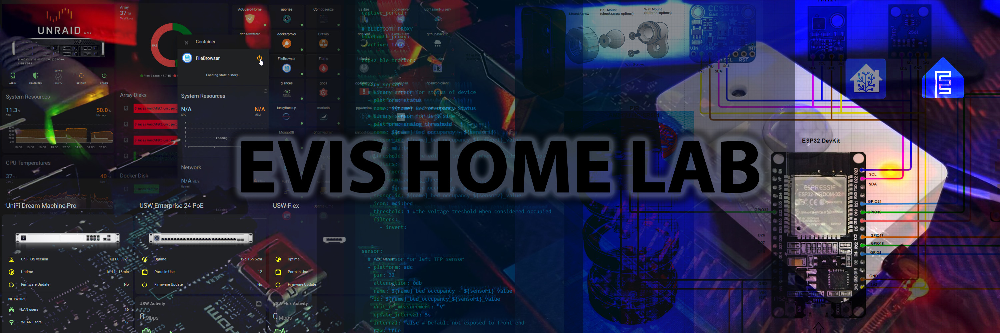

# Smart Home | Home-Assistant

## Home Assistant Dashboards
*Using (custom) integrations to build dashboards*
* [Unifi Network Dashboard](dashboards/unifi-network-dashboard/)
* [Unifi Access Points Dashboard](dashboards/unifi-ap-dashboard/)
* [ESXi VM Dashboard](dashboards/esxi-vm-dashboard/)
* [UnRAID Dashboard](dashboards/unraid/)
* [Synology Dashboard](dashboards/synology-dashboard/)
* [Nest Protect](dashboards/nest-protect/)
* [Person Dashboard](dashboards/person-dashboard/)
* [DNS AdGuard Dashboard](dashboards/dns-dashboard/)
* [Energy Dashboard](/dashboards/energy/readme.md)

## Home Assistant Cards & Templates
* Todays Energy Price and Usage
* [Room Card | Declutter Template](https://github.com/EvisHome/Home-Assistant/blob/main/cards/room-card.md)
  * [Presence Model - Node-RED](https://github.com/EvisHome/Home-Assistant/blob/main/node-red/room-occupancy-model.md)
  * Automated Lights Model [Node-RED]
 
## Node-RED
* [Presence Model](https://github.com/EvisHome/Home-Assistant/blob/main/node-red/room-occupancy-model.md)
* Automated Lights Model
* Hue Dimmer Switch (v1)
* Hue Tap Dial Switch

## Examples/References
*Includes CSS tricks with card_mod, card combinations to control devices etc.*
* [automation delay visualization](examples/automation-delay-visualization/readme.md)
* [mushroom-chip-card examples](examples/mushroom-chip-card/)
* [air-purifier card (with mushroom cards)](examples/air-purifier/)
* [apexcharts-card examples](examples/apexcharts-card)
* [Sticky Top Card](examples/sticky-top-card/)

## ESPHome Projects

* [Bed Occupancy Sensor(s)](esphome/bed-occupancy-sensor/)
* [Project Box Creator](esphome/project-box-creator/readme.md)
* [Horizontal Blinds (tilt)](esphome/horizontal-blinds/)
* [Room Presence](esphome/presence/)
* [Room Presence v2 / Presence Box](esphome/presence-box-2/)

## Smart Speaker
* [DIY Smart Speaker (Pi Zero 2w & Respeaker 2mic hat + OpenAI with Nabu Casa)](smart-speaker/readme.md)

## WLED Projects
* [Virtual Fireplace](wled/virtual-fireplace/readme.md)

## Other Projects | Printable 3D Models
* [Philips Hue Motion Sensor - Wall Mount](https://github.com/EvisHome/Home-Assistant/tree/main/other-projects/philips-hue-motion-sensor-mount)
* [Philips Hue Motion Sensor - Eye Lid](https://github.com/EvisHome/Home-Assistant/tree/main/other-projects/philips-hue-motion-sensor-eye-lid)

## Themes
*This needs some work ..*
* [evis-theme](themes/readme.md)
