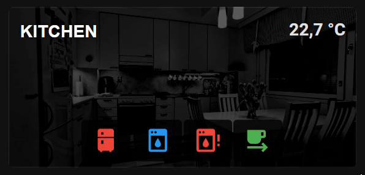
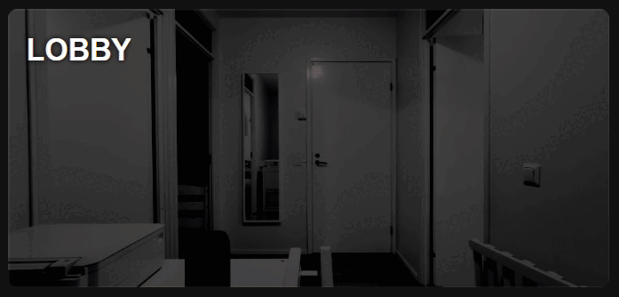

# Room Card | Declutter Card

<p float="left">   </p> 

## Overview
This card needs some perquisites and uses my custom built [presence model in Node-RED](https://github.com/EvisHome/Home-Assistant/blob/main/node-red/room-occupancy-model.md) (it can be removed, it's marked in the YAML code).

 
The card allows quickly setting similar looking area cards, visualizing room occupancy, room light group status, and up to 6 different devices or sensors. The device icons, colors, state values can be quite easily be customized per card as needed. The Devices or sensors will be visible while the states match.
<br><br>
## Background
I wanted a card that I can quickly turn room lights on or off, see an overview of the room, occupancy, temperature and other sensor and devices states. And like I normally do, I wanted it my way .. customized and over engineered.
<br><br>
## Prerequisites
You need to have some helper entities set for this and follow few entity naming practices.
<br><br>
### Naming practices
Your area or room light group should be named as (or you can modify the code as needed. I have greate helper light groups for all the rooms I have.

* light.AREA_lights

When long pressing (hold_action) the card these lights will be toggled on and off.
<br><br>
### View navigation path

* /lovelace/AREA

When the card is clicked (tap_action) in the this will take you to the area specific view, which the navigation path points to.

 
I have setup my Home view as the first view and I have set my rooms and other areas as subviews.


<br><br>
### Helper Entities
Following helper entities are needed. (or you can remove the part of the code if you don't want these). These are part of my area presence systems and lights automation. In short you can use presence activated and deactivated lights or absence based deactivation of lights, when rooms or areas are not occupied. Different states of area presence is indicated with card border color.

The timer is used to visualize the time left when the lights will be turned off.

timer.AREA_lights_off_timer
input_select.[[entity_name]]_presence : presence | idle | absence
<br><br>
### Area Picture
Area picture in the following path, or change the path as needed.
 
* local/rooms/room_AREA.jpg
<br><br>
## Custom Cards

You need to have the following custom-cards installed with HACS.
 
* custom:streamline-card | custom:decluttering-card (not maintained)
* custom:button-card
* custom:mushroom-chips-card
* custom:timer-bar-card
* card-mod
<br><br>
### Sections view & Layout
The same YAML works with both custom:decluttering-card and custom:streamline-card. I am still using the unmainteined decluttering card as the streamline card acts a bit weird with the new sections layouts.
 
I use this card half the column width, declutter card don't visually support the layout change from the UI, but works if you add it in to yaml example

```yaml
layout_options:
  grid_columns: 2
```

The streamline card looks nice in the UI, and seems to support the layout .. but not really. It doesn't remember the layout setting when you re-edit the card, and by default it sets the row value which in this case messes up with the card height, which probably more about my YAML (it can be fixed by removing the rows value) or using the same example from above
<br><br>
## View Raw Configuration Editor

```yaml
decluttering_templates: # works, but not maintained anymore
# streamline_templates: # should work as a drop in replacement

  area_card:
    card:
      type: picture-elements
      elements:
        - type: custom:button-card
          entity: light.[[entity_name]]_lights
          show_name: false
          show_icon: false
          tap_action:
            action: navigate
            navigation_path: /lovelace/[[entity_name]]  # THE AREA VIEW NAVIGATION PATH
          hold_action:
            action: toggle
          double_tap_action:
            action: toggle
          style:
            top: 50%
            left: 50%
            width: 100%
            height: 100%
            z-index: 3
          styles:
            card:
              - border-radius: 8px
              - height: 100%
              - background-color: rgba(0,0,0,0)
              - box-shadow: 0px 0px

          ## AREA OCCUPANCY VISUALIZATION >> | CAN BE REMOVED IF THE PRESENCE MODEL IS NOT SET UP
          card_mod:
            style: |
              ha-card {
                
                  border: 3px solid rgba(36, 255, 0, 0.8);
                
                  border: 3px solid rgba(255, 163, 0, 0.8);
                
                  border: 0px solid rgba(0, 0, 0, 0);
                
              }
          # << AREA OCCUPANCY VISUALIZATION
          
        - type: custom:button-card
          name: '[[display_name]]'
          style:
            top: 50%
            left: 50%
            width: 100%
            height: 100%
            z-index: 2
            container-type: inline-size
          styles:
            card:
              - border-radius: 0px
              - border: 0px
              - height: 30%
              - background-color: rgb(0,0,0,0)
              - box-shadow: 0px 0px 2px rgb(255,255,255,0)
              - font-size: 5cqw
            name:
              - font-family: arial
              - font-weight: bold
              - text-transform: uppercase
              - justify-self: left
              - padding-left: 15px
              - color: rgb(255, 255, 255, 1)
              - text-shadow: 0px 0px 5px rgb(0,0,0,1)

          ## TEMPERATURE >> | CAN BE USED TO SHOW SOME OTHER VALUE AS WELL    
        - type: custom:button-card
          entity: '[[temperature_sensor]]'
          icon: mdi:account-circle
          show_name: false
          show_icon: true
          show_state: true
          tap_action:
            action: none
          hold_action:
            action: none
          style:
            top: 50%
            left: 50%
            width: 100%
            height: 100%
            z-index: 2
            container-type: inline-size
          styles:
            name:
              - display: none
            card:
              - border-radius: 0px
              - height: 100%
              - background-color: rgb(0,0,0,0)
              - box-shadow: 0px 0px
            icon:
              - display: none
              - height: 19%
            state:
              - position: absolute
              - top: 7%
              - right: 3%
              - font-size: 5cqw
              - font-weight: bold
              - text-shadow: 0px 0px 5px rgb(0,0,0,1)
          # << TEMPERATURE

          ## DEVICE OR SENSOR STATES VISUALIZED ON THE CARD >>
        - type: custom:mushroom-chips-card
          chips:
            - type: template
              entity: '[[device_1]]'
              icon: '[[device_1_icon]]'
              icon_color: |
                
                  [[device_1_color]]
                
                  gray
                
              card_mod:
                style: |
                  @keyframes blink {
                    50% { opacity: 0; }
                  }
                  :host {
                    
                      display: flex;
                    
                      display: none;
                    
                  }
                  ha-card {
                    animation: [[device_1_animation]] 1s ease infinite;
                    --chip-box-shadow: 0px 0px;
                    --chip-background: rgba(0,0,0,0.8);
                    --chip-border-width: 0;
                  }
            - type: template
              entity: '[[device_2]]'
              icon: '[[device_2_icon]]'
              icon_color: |
                
                  [[device_2_color]]
                
                  gray
                
              card_mod:
                style: |
                  @keyframes blink {
                    50% { opacity: 0; }
                  }
                  :host {
                    
                      display: flex;
                    
                      display: none;
                    
                  }
                  ha-card {
                    animation: [[device_2_animation]] 1s ease infinite;
                    --chip-box-shadow: 0px 0px;
                    --chip-background: rgba(0,0,0,0.8);
                    --chip-border-width: 0;
                  }
            - type: template
              entity: '[[device_3]]'
              icon: '[[device_3_icon]]'
              icon_color: |
                
                  [[device_3_color]]
                
                  gray
                
              card_mod:
                style: |
                  @keyframes blink {
                    50% { opacity: 0; }
                  }
                  :host {
                    
                      display: flex;
                    
                      display: none;
                    
                  }
                  ha-card {
                    animation: [[device_3_animation]] 1s ease infinite;
                    --chip-box-shadow: 0px 0px;
                    --chip-background: rgba(0,0,0,0.8);
                    --chip-border-width: 0;
                  }
            - type: template
              entity: '[[device_4]]'
              icon: '[[device_4_icon]]'
              icon_color: |
                
                  [[device_4_color]]
                
                  gray
                
              card_mod:
                style: |
                  @keyframes blink {
                    50% { opacity: 0; }
                  }
                  :host {
                    
                      display: flex;
                    
                      display: none;
                    
                  }
                  ha-card {
                    animation: [[device_4_animation]] 1s ease infinite;
                    --chip-box-shadow: 0px 0px;
                    --chip-background: rgba(0,0,0,0.8);
                    --chip-border-width: 0;
                  }
            - type: template
              entity: '[[device_5]]'
              icon: '[[device_5_icon]]'
              icon_color: |
                
                  [[device_5_color]]
                
                  gray
                
              card_mod:
                style: |
                  @keyframes blink {
                    50% { opacity: 0; }
                  }
                  :host {
                    
                      display: flex;
                    
                      display: none;
                    
                  }
                  ha-card {
                    animation: [[device_5_animation]] 1s ease infinite;
                    --chip-box-shadow: 0px 0px;
                    --chip-background: rgba(0,0,0,0.8);
                    --chip-border-width: 0;
                  }
            - type: template
              entity: '[[device_6]]'
              icon: '[[device_6_icon]]'
              icon_color: |
                
                  [[device_6_color]]
                
                  gray
                
              card_mod:
                style: |
                  @keyframes blink {
                    50% { opacity: 0; }
                  }
                  :host {
                    
                      display: flex;
                    
                      display: none;
                    
                  }
                  ha-card {
                    animation: [[device_6_animation]] 1s ease infinite;
                    --chip-box-shadow: 0px 0px;
                    --chip-background: rgba(0,0,0,0.8);
                    --chip-border-width: 0;
                  }
          alignment: center
          style:
            top: 120%
            left: 50%
            width: 100%
            height: 100%
            z-index: 2
            container-type: inline-size
          card_mod:
            style: |
              ha-card {
                --chip-height: 12cqw;
                --chip-icon-size: 8cqw;
                --chip-border-radius: 5px;
                --chip-spacing: 2px;
                --chip-background: rgba(0,0,0,0);
                --chip-box-shadow: 0px 0px;
                --chip-border-width: 0;
              }
          # << DEVICE OR SENSOR STATES VISUALIZED ON THE CARD

          ## LIGHTS OFF TIMER >> | CAN BE REMOVED IF THE PRESENCE MODEL IS NOT USED
        - type: custom:timer-bar-card
          entities:
            - timer.[[entity_name]]_lights_off_timer
          invert: true
          sync_issues: ignore
          bar_height: 2px
          bar_foreground: orange
          bar_background: '#111'
          layout: full_row
          text_width: 0px
          bar_width: 100%
          card_mod:
            style: |
              :host {
                width: 100%;
                margin: 0px;
                padding: 0px;
                border: 0px;
              }
              ha-card {
                left: 44%;
                width: 113%;
                height: 4px;
                padding: 0px;
                z-index: 3;
                margin: 0px;
                margin-top: -39px;
                border: 0px;
                background-color: rgb(0,0,0,0);
                box-shadow: 0px 0px 2px rgb(255,255,255,0);
              }
          # << LIGHTS OFF TIMER
          
      entity: light.[[entity_name]]_lights
      image: local/rooms/room_[[entity_name]].jpg

      ## CHANGES THE AREA IMAGE BASED ON THE AREA LIGHT STATUS >>
      state_filter:
        'on': brightness(100%) saturate(1.2)
        'off': brightness(40%) grayscale(100%) contrast(150%)
      # << CHANGES THE AREA IMAGE BASED ON THE AREA LIGHT STATUS
        
      card_mod:
        style: |
          ha-card {
            top: 0%;
            border: 0px;
            border-top-left-radius: 8px;
            border-top-right-radius: 8px;
            border-bottom-left-radius: 8px;
            border-bottom-right-radius: 8px;
            border-color: rgba(0,0,0,0)
            z-index: 0;
          }
```
<br><br>
## Card Configuration

You can have up to 6 devices, in my Kitchen example I only have 5 devices.


<br><br>
### Card Configuration

```yaml
type: custom:decluttering-card
# type: custom:streamline-card
template: area_card
variables:
  - entity_name: kitchen
  - display_name: Kitchen
  - temperature_sensor: sensor.kitchen_fridge_door_temperature
  - device_1: binary_sensor.kitchen_fridge_door_contact
  - device_1_icon: mdi:fridge
  - device_1_state: "on"
  - device_1_color: red
  - device_1_animation: blink
  - device_2: sensor.coffee_machine_state
  - device_2_icon: mdi:coffee
  - device_2_state: Running
  - device_2_color: orange
  - device_2_animation: blink
  - device_3: sensor.dishwasher_state
  - device_3_icon: mdi:dishwasher
  - device_3_state: Running
  - device_3_color: blue
  - device_3_animation: none
  - device_4: binary_sensor.kitchen_dishwasher_leak_sensor_water_leak
  - device_4_icon: mdi:dishwasher-alert
  - device_4_state: "on"
  - device_4_color: red
  - device_4_animation: blink
  - device_5: switch.schedule_coffee_machine_schedule
  - device_5_icon: mdi:coffee-to-go
  - device_5_state: "on"
  - device_5_color: green
  - device_5_animation: none
```
<br><br>
### Examples
This example how I am using this presence model in tandem with the declutter room card and my light automation visualization. A speed up version of me coming home from the front-door, to mud room, through hallway to kitchen .. checking the fridge, turning on coffee machine ..

