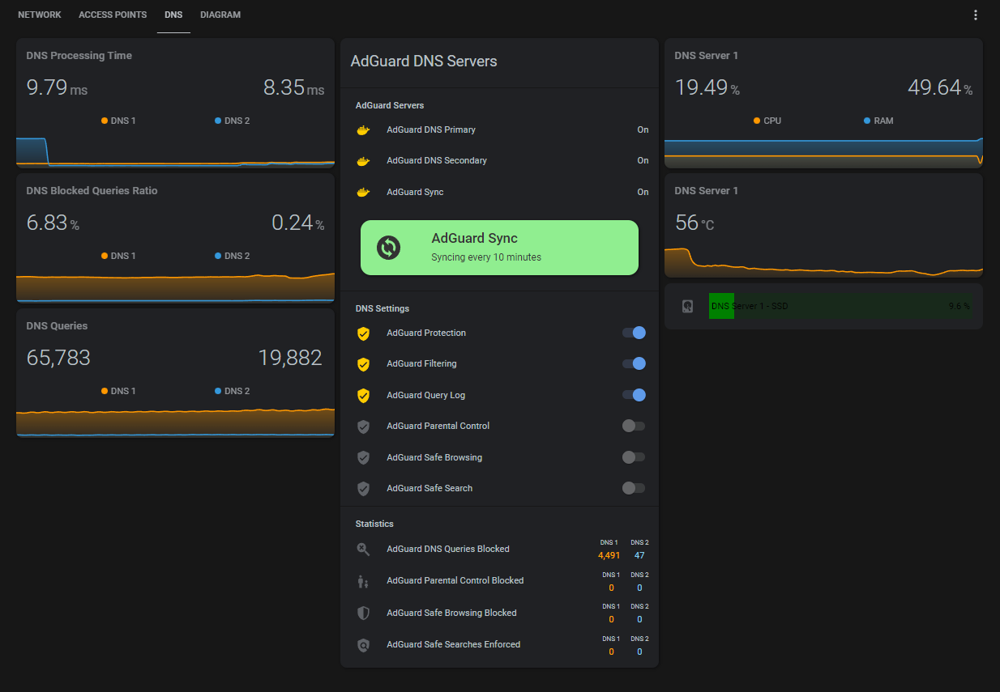

## DNS (Dashboard)

Standard HA Integrations:
* Adguard Home
* Glances

Custom Integrations Used:
* Monitor Docker

Custom HACS frontend cards & elements used:
* [multiple-entity-row](https://github.com/benct/lovelace-multiple-entity-row)
* [mini-graph-card](https://github.com/kalkih/mini-graph-card)

