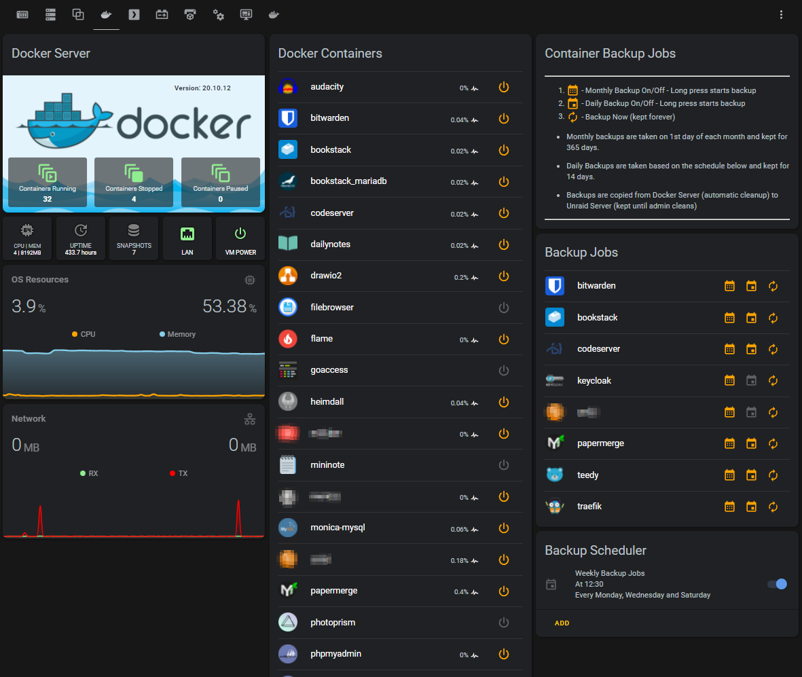

## DOCKER SERVER (Dashboard)

-- drop me a line if you need more detailed setup info and I'll see what I can do --

Standard HA Integrations
* Glances (glances container needs to run on the remote docker)

Custom Integrations Used:
* [Monitor Docker](https://github.com/ualex73/monitor_docker) (dockerproxy container needs to run on the remote docker)
* [Scheduler](https://github.com/nielsfaber/scheduler-component)
* [ESXi Stats](https://github.com/wxt9861/esxi_stats) (This Docker server runs as VM in ESXi, to fully use this a proper license is needed)

Frontend Cards:
* [scheduler-card](https://github.com/nielsfaber/scheduler-card) (For Weekly Backup Jobs, Montlys is a BigTimer in Node-RED)
* [button-card](https://github.com/custom-cards/button-card)
* [mini-graph-card](https://github.com/kalkih/mini-graph-card)
* [auto-entities](https://github.com/thomasloven/lovelace-auto-entities)
* [card-mod](https://github.com/thomasloven/lovelace-card-mod)

