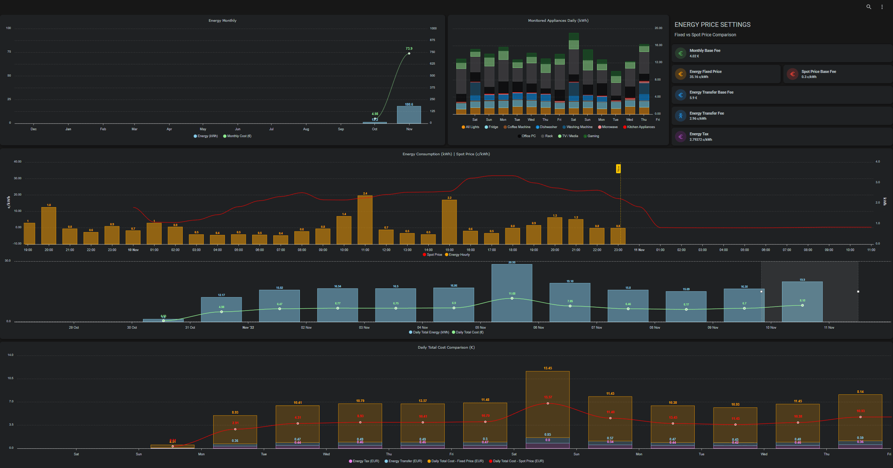
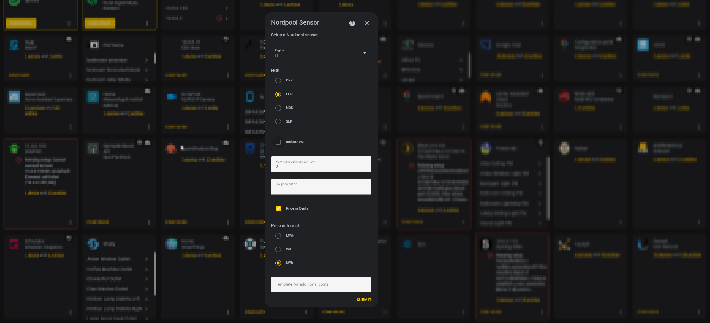
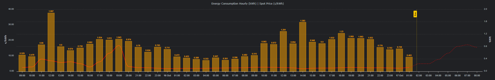
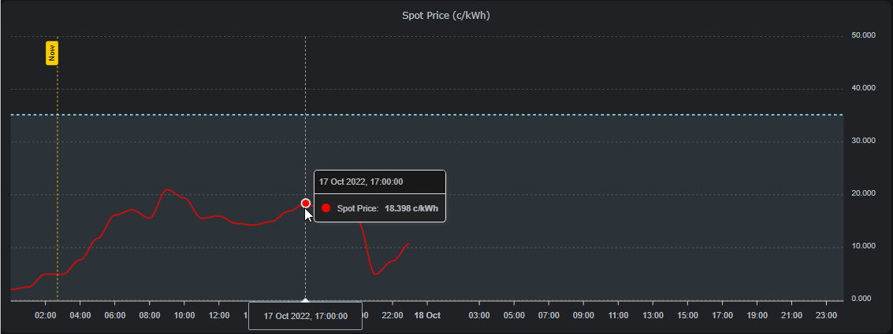
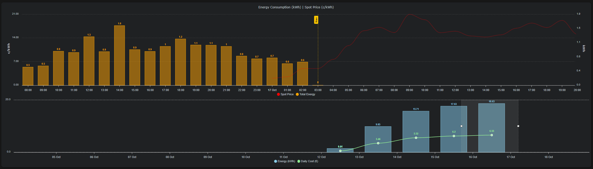
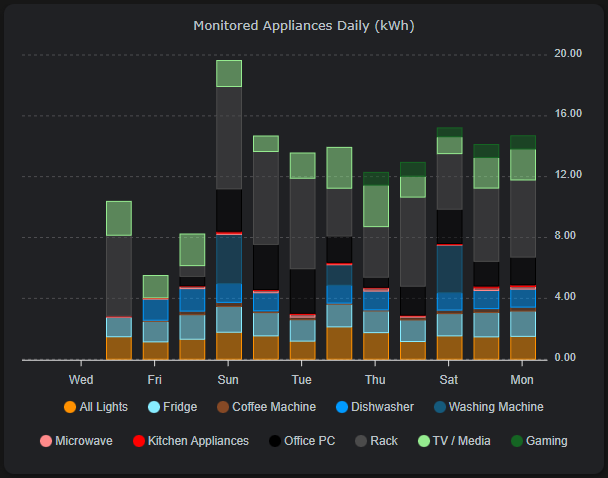

# Energy Dashboard (Not updating this one, might be broken?)

## Overview

I currently have fixed price contract, which adjusts prices every 3 months. Not sure if it's the best one so I want to compare to the spot prices and if I at somepoint change over to spot pricing then I have the setup ready it. I also wanted to see some actual data how much different devices and rooms consume energy, so some Shelly Plus 1PMs and 2.5 have been installed around the house, but not on all outlets. To keep an eye out for total consumption I have an Shelly 3EM, which is still in the mail (I'll try to update this once I have that installed as well)

As a background this all started from a dinner conversation with the kids about the energy costs and what we could do to save energy, and how to actually track how much we could save .. so we started this family challenge, how much energy we could save.

Some items we listed that we thought might make the biggest savings:
* reduce the amount of laundry -> no need to run the washing machine so often
* reduce the amount of dished -> no need to run the dishwasher so often
* turn off devices when not in use (fully off, not just standby mode)
* precense guided lights ([Room Presence](https://github.com/EvisHome/Home-Assistant/blob/main/esphome/presence) & [Presence Box 2](Presence Box 2)
* I have also started to automate turning on/off some rack devices during night or when we are away

## Custom Integrations & Cards

* [Nordpool custom component for Home Assistant](https://github.com/custom-components/nordpool)
* [PowerCalc (virtual power & utility sensors)](https://github.com/bramstroker/homeassistant-powercalc)
* [Apexcharts-card](https://github.com/RomRider/apexcharts-card)

### Nordpool Integration & Sensor Setup

Easiest way to install, is to follow the HACS installation option. After installation, I setup the sensor using the WebUI.
1. Go the Home Assistant Settings
2. Go to Devices & Settings and to the Integrations Tab
3. Click add integration and search for Nordpool and setup the sensor (NOTE: I used prices in Cents, so some of the graph calculations maybe setup according to cents, if you have something else you may need to adjust the calculations)

### PowerCalc integration

PowerCalc is a great way to create virtual power (W) and energy (kWh) sensors for lights and power plugs, and also utility sensors (measuring hourly, daily, monthly, yearly consumption). By default it creates quite many new sensors. Here is a [great video about PowerCalc by BeardedTinker](https://www.youtube.com/watch?v=tR1x-cxwK-8). I recommend you watch the video. It can be a bit of work to get it as you like, a but I found it worth while, to get the monitoring just the way I wanted. I went first with the default settings, but later on I ended up redoing everything, removing individual light utility sensors and made some nested groupings instead, following this kind of nesting logic.

* All Devices
* -- All Outlets
* ---- Room 1 outlets
* ---- Room 2 outlets
* ---- ...
* -- All Lights
* ---- Room 1 lights
* ---- Room 2 lights
* ---- ...

Here is my grouping and [PowerCalc sensor configuration YAML](powercalc-configuration.yaml). It's still a LOT of additional entities, I may still adjust it later on, but for now I just wanted to see the data, so I can to see what is possible and what to use.

Not all my lights are Smart lights, but the ones that are not, are still controlled by smart switches, so I know when they are on or off. PowerCalc lets you still create virtual sensors for normal lights also, all you need to know is how much power (W) the bulbs/lights use when powered on. These normal light sensors I created through the PowerCalc integration WebUI.

## Helpers

I created few helper entities to help calculate the costs.

* input_number.energy_base_fee (monthly base fee in euros)
* input_number.energy_fixed_fee (this is the fixed c/kWh fee that adjusts every 3 months)
* input_number.energy_tax (energy tax in c/kWh)
* input_number.energy_transfer_base_fee (monthly energy transfer base fee)
* input_number.energy_transfer_fee (transfer fee in c/kWh)
* input_number.energy_spot_price_base_fee (spot price base fee in c/kWh, this added to the spot price)

## Additional Sensors

Created few sensors which calculate the costs shown in the charts

* sensor.total_energy_price = energy_fixed_fee + energy_tax + energy_transfer_fee
* sensor.total_energy_cost_daily = total_energy_price * total daily energy consumption
* sensor.total_energy_cost_monthly = total_energy_price * total monthly energy consumption
* sensor.total_energy_spot_price = energy spot price + energy_spot_price_base_fee + energy_tax + energy_transfer_fee

## The Dashboard / View

I used nested Grids to place the apexcharts-cards in their places.

## Charts

### Energy Consumption Hourly (kWh) & Spot Price (c/kWh)
This chart shows the hourly consumption (currently from all the outlets, but once I have the shelly 3EM I'll change it the data to that.) Also shows the Nordpool spot price history and pulls todays and tomorrows prices from the integration when available.

* [energy-consumption-hourly.yaml](energy-consumption-hourly.yaml)

### Spot Price (c/kWh)

Shows the Nordpool integration spot price for today and tomorrow. The tomorrow values can be empty at times, depending when the prices are available, for it seems they update around 14:00.

* [spot-price-chart.yaml](spot-price-chart.yaml)

### Monitored Appliances Daily (kWh)

### Energy Brush Chart

This is combining the Energy Consumption Hourly, Energy Daily and Spot Price charts in to one brush chart, allowing to narrow down or extend the chart time span. I am still not sure if I'll include it in to my dashboard, due to some slowness at times.

* [energy-brush-chart.yaml](energy-brush-chart.yaml)

### Monitored Appliances Daily Chart

Stacked daily energy consumption view on appliances of interest. This is to give a more insight on how much energy is consumed by different appliances and devices. My rack with network devices, multiple chained PoE devices and servers is actually consuming way more than I'd like. To save atleast some energy, I have started to automatically turning some devices on and off based on time of day and presence. I am also moving some "essential" services to lower power devices, like my NUCs and Pi4s. Office Desktop PC is now also going to sleep faster if no presece in the the office.

* [monitored-appliances-daily.yaml](monitored-appliances-daily.yaml)
