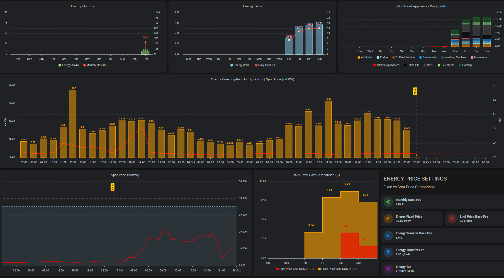

# Energy Dashboard

## Overview

I currently have fixed price contract, which adjusts prices every 3 months. Not sure if it's the best one so I want to compare to the spot prices and if I at somepoint change over to spot pricing then I have the setup ready it. I also wanted to see some actual data how much different devices and rooms consume energy, so some Shelly Plus 1PMs and 2.5 have been installed around the house, but not on all outlets. To keep an eye out for total consumption I have an Shelly 3EM, which is still in the mail (I'll try to update this once I have that installed as well)

As a background this all started from a dinner conversation with the kids about the energy costs and what we could do to save energy, and how to actually track how much we could save .. so we started this family challenge, how much energy we could save.

Some items we listed that we thought might make the biggest savings:
* reduce the amount of laundry -> no need to run the washing machine so often
* reduce the amount of dished -> no need to run the dishwasher so often
* turn off devices when not in use (fully off, not just standby mode)
* precense guided lights ([Room Presence](https://github.com/EvisHome/Home-Assistant/blob/main/esphome/presence) & [Presence Box 2](Presence Box 2)
* I have also started to automate turning on/off some rack devices during night or when we are away

## Custom Integrations & Cards

* [Nordpool custom component for Home Assistant](https://github.com/custom-components/nordpool)
* [Apexcharts-card](https://github.com/RomRider/apexcharts-card)

## Helpers

I created few helper entities to help calculate the costs.

* input_number.energy_base_fee (monthly base fee in euros)
* input_number.energy_fixed_fee (this is the fixed c/kWh fee that adjusts every 3 months)
* input_number.energy_tax (energy tax in c/kWh)
* input_number.energy_transfer_base_fee (monthly energy transfer base fee)
* input_number.energy_transfer_fee (transfer fee in c/kWh)
* input_number.energy_spot_price_base_fee (spot price base fee in c/kWh, this added to the spot price)

## Additional Sensors

Created few sensors which calculate the costs shown in the charts

* sensor.total_energy_price = energy_fixed_fee + energy_tax + energy_transfer_fee
* sensor.total_energy_cost_daily = total_energy_price * total daily energy consumption
* sensor.total_energy_cost_monthly = total_energy_price * total monthly energy consumption
* sensor.total_energy_spot_price = energy spot price + energy_spot_price_base_fee + energy_tax + energy_transfer_fee

## The Dashboard / View

I used nested Grids to place the apexcharts-cards in their places.

## Charts

### Energy Consumption Hourly (kWh) & Spot Price (c/kWh)
