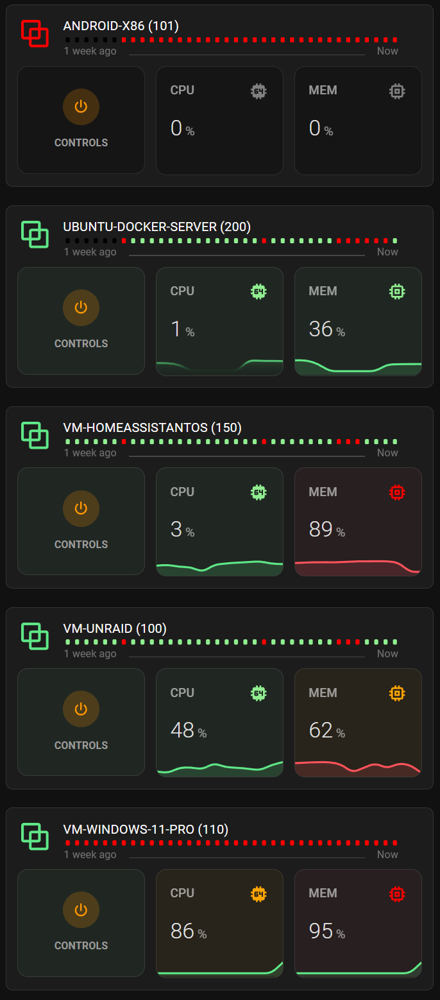

# Proxmos dashboard

Requires

* [Proxmox VE integration](https://www.home-assistant.io/integrations/proxmoxve/)
* [lovelace-card-mod](https://github.com/thomasloven/lovelace-card-mod)

* custom:mushroom-title-card
* custom:auto-entities
* custom:button-card
* custom:mini-graph-card
* custom:mushroom-template-card
* custom:uptime-card

*Note: this YAML Does't include controls popup*



You may need to change the auto-entity filter or some of the "replace strings" depending how your entities are named. I tried to used the standard naming from the Proxmox integration

``` YAML
type: vertical-stack
cards:
  - type: custom:mushroom-title-card
    title: VIRTUAL MACHINES
    alignment: center
    subtitle: NODE | HALO
  - type: custom:auto-entities
    card:
      type: grid
      columns: 1
      square: false
    card_param: cards
    sort:
      method: name
    filter:
      include:
        - entity_id: sensor.*qemu*cpu*
          options:
            type: custom:button-card
            layout: icon_name_state2nd
            show_name: true
            show_state: false
            show_icon: false
            show_label: false
            card_mod:
              style: |
                ha-card {
                  overflow: visible;
                  border-top: 1px solid #333333;
                }
            name: |
              [[[
                var name = states['this.entity_id'].attributes.friendly_name;
                name = name.replace("QEMU ", "");
                name = name.replace(" CPU used", "");
                return name
              ]]]
            styles:
              name:
                - position: absolute
                - top: 15px
                - left: 65px
                - color: white
                - font-size: 15px
                - text-transform: uppercase
              state:
                - position: absolute
                - top: 37px
                - left: 65px
                - font-size: 12px
              card:
                - border-radius: 8px
                - height: 210px
                - overflow: unset
                - margin-bottom: 13px
                - padding: 0px
              custom_fields:
                cpugraph:
                  - position: absolute
                  - top: 70px
                  - left: 35%
                  - margin: 0px
                  - padding: 0px
                  - margin-bottom: 10px
                  - width: 30%
                  - display: block
                memgraph:
                  - position: absolute
                  - top: 70px
                  - left: 67.5%
                  - margin: 0px
                  - padding: 0px
                  - margin-bottom: 10px
                  - width: 30%
                  - display: block
                netgraph:
                  - position: absolute
                  - top: 70px
                  - left: 67.5%
                  - margin: 0px
                  - padding: 0px
                  - margin-bottom: 10px
                  - width: 30%
                  - display: block
                icon:
                  - margin: 0px
                  - padding: 0px
                  - position: absolute
                  - left: '-12px'
                  - top: 12px
                power:
                  - position: absolute
                  - top: 70px
                  - left: 2.5%
                  - margin: 0px
                  - padding: 0px
                  - margin-bottom: 10px
                  - width: 30%
                  - height: 124px
                  - display: block
                ip:
                  - position: absolute
                  - top: 28px
                  - left: 64px
                  - margin: 0px
                  - padding: 0px
                  - display: block
                uptime:
                  - position: absolute
                  - top: 10px
                  - left: 50px
                  - width: 85%
                  - margin: 0px
                  - padding: 0px
                  - display: block
                navoverlay:
                  - margin: 0px
                  - padding: 0px
                  - position: absolute
                  - width: 100%
                  - height: 100%
                  - right: 0px
                  - top: 0px
                  - z-index: 90
            custom_fields:
              icon:
                card:
                  type: custom:button-card
                  entity: |-
                    [[[
                      return 'this.entity_id'.replace("_cpu_used", "_status");
                    ]]]
                  name: Icon
                  icon: mdi:vector-combine
                  show_name: false
                  show_state: false
                  style: |
                    ha-card {
                      box-shadow: none;
                      border: 0px;
                    }
                  styles:
                    card:
                      - width: 90px
                      - background-color: rgba(0,0,0,0)
                      - border: 0px
                    icon:
                      - color: red
                      - filter: drop-shadow(0px 0px 2px rgba(0,0,0,0)
                  state:
                    - value: running
                      styles:
                        icon:
                          - color: rgba(95, 231, 135, 1)
              cpugraph:
                card:
                  type: custom:mini-graph-card
                  entities:
                    - entity: this.entity_id
                      name: CPU
                  font_size_header: 12
                  font_size: 75
                  line_width: 8
                  height: 75
                  animate: true
                  hours_to_show: 24
                  decimals: 0
                  show:
                    points: false
                  color_thresholds:
                    - value: 0
                      color: rgba(0, 0, 0, 0)
                    - value: 1
                      color: '#5FE787'
                    - value: 70
                      color: '#5FE787'
                    - value: 80
                      color: '#FF9800'
                    - value: 90
                      color: '#FF535B'
                  card_mod:
                    style: |
                      .header.flex .icon {
                        
                        
                          color: red;
                        
                          color: orange;
                        
                          color: lightgreen;
                        
                          color: gray;
                         }
                      ha-card {
                        
                          --ha-card-background: rgba(255, 83, 91, 0.05);
                        
                          --ha-card-background: rgba(255, 152, 0, 0.05);
                        
                          --ha-card-background: rgba(95, 231, 135, 0.05);
                        
                          --ha-card-background: rgba(0, 0, 0, 0.25);
                         }
                      }
              memgraph:
                card:
                  type: custom:mini-graph-card
                  entities:
                    - entity: |-
                        [[[
                          return 'this.entity_id'.replace("_cpu_used", "_memory_used_percentage");
                        ]]]
                      name: MEM
                  font_size_header: 12
                  font_size: 75
                  line_width: 8
                  height: 75
                  animate: true
                  decimals: 0
                  hours_to_show: 24
                  show:
                    points: false
                  color_thresholds:
                    - value: 0
                      color: rgba(0, 0, 0, 0)
                    - value: 1
                      color: '#5FE787'
                    - value: 50
                      color: '#5FE787'
                    - value: 60
                      color: '#FF9800'
                    - value: 80
                      color: '#FF535B'
                  card_mod:
                    style: |
                      .header.flex .icon {
                        
                        
                        
                          color: red;
                        
                          color: orange;
                        
                          color: lightgreen;
                        
                          color: grey;
                        
                      }
                      ha-card {
                        
                          --ha-card-background: rgba(255, 83, 91,0.05);
                        
                          --ha-card-background: rgba(255, 152, 0,0.05);
                        
                          --ha-card-background: rgba(95, 231, 135,0.05);
                        
                          --ha-card-background: rgba(0, 0, 0, 0.25);
                         }
                      }
              power:
                card:
                  type: custom:mushroom-template-card
                  primary: ''
                  secondary: CONTROLS
                  icon: mdi:power
                  entity: |-
                    [[[
                      var uptime_id = 'this.entity_id'.replace("_cpu_used", "_status");
                      return uptime_id;
                    ]]]
                  icon_color: >-
                    

                    

                    
                      orange
                    
                      orange
                    
                  layout: vertical
                  fill_container: true
                  card_mod:
                    style: |
                      ha-card {
                        width: 100%;
                        
                        
                        
                          --ha-card-background: rgba(95, 231, 135,0.05);
                        
                           --ha-card-background: rgba(0, 0, 0, 0.25);
                        
                      }
              uptime:
                card:
                  type: custom:uptime-card
                  entity: |-
                    [[[
                      var uptime_id = 'this.entity_id'.replace("_cpu_used", "_status");
                      uptime_id = uptime_id.replace("sensor.", "binary_sensor.");
                      return uptime_id;
                    ]]]
                  title_template: UPTIME
                  hours_to_show: 168
                  alignment:
                    status: spaced
                    header: center
                    icon_first: false
                  alias:
                    ok: Running
                    ko: Unvailable
                    none:
                      - unknown
                      - unavailable
                  color:
                    ko: red
                    ok: lightgreen
                    half: red
                    icon: orange
                    none: black
                  bar:
                    spacing: 8
                    height: 8
                    round: 2
                  show:
                    header: false
                    status: false
                    footer: true
                    average: false
                  card_mod:
                    style: |
                      :host {
                        border-style: none;
                      }
                      ha-card {
                        border: 0px;
                        box-shadow: none;
                        border-style: none;
                        background-color: rgba(0,0,0,0);
                        font-size: 12px
                      }
                  hold_Action:
                    action: more-info
                  tap_action:
                    action: more-info

```
