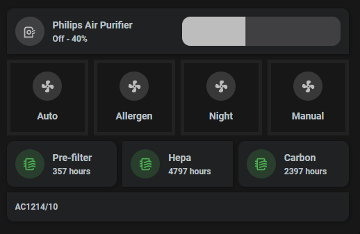

For Philips Air Purifier 1214/10 whitch uses the HTTP protocol for communication, I used https://github.com/GeorgeSG/philips_airpurifier_http integration, which is a fork of xMrVizzy/philips-airpurifier..

The Dashboard controls use Grid, Mushroom Cards and Card Mod.

You can switch the mode from the four buttons, or change the speed from the slider, which then automatically puts the purifier into manual mode. Few visual tricks for the fan spinning faster or slower, depending the actual speed percentage. The filter turn to yellow, when there is a week left, and to red when 48 hours left.

**My fan entity**


Everything is wrapped in a one column Grid
```yaml
type: grid
square: false
columns: 1
cards:
```

1. First Row is a mushroom-fan-card
- change the entity *fan.philips_air_purifier* to your fan entity
```yaml
  - type: custom:mushroom-fan-card
    entity: fan.philips_air_purifier
    show_percentage_control: true
    layout: horizontal
    tap_action:
      action: toggle
    hold_action:
      action: more-info
    double_tap_action:
      action: none
    card_mod:
      style: |
        ha-card {
          border-bottom-right-radius: 0px;
          border-bottom-left-radius: 0px;
        }
```

2. Second Row - is Grid of 4 Columns
```yaml
  - square: false
    columns: 4
    type: grid
    cards:
```
- Using *custom:mushroom-template-card*
  - change replace the *fan.philips_air_purifier* with your fan entity, and make the same change in the in the card_mod style part where used.
  - In each card the *mode == auto* matches the modes the device supports (modify in 2 places to your needs), change for each card. Also change the *primary: Auto* text.
 
```yaml
      - type: custom:mushroom-template-card
        entity: *fan.philips_air_purifier*
        primary: Auto
        secondary: ''
        icon: mdi:fan
        layout: vertical
        icon_color: |
          
          
          
          
            blue
          
            disabled
          
          
            disabled
          
        tap_action:
          action: call-service
          service: fan.set_preset_mode
          data:
            preset_mode: auto
          target:
            entity_id: fan.philips_air_purifier
        card_mod: null
        style:
          mushroom-shape-icon:
            $: |
              .shape ha-icon
                {
                  
                  
                  
                  
                  
                  
                  --icon-animation: rotation 2s linear infinite;
                  
                  --icon-animation: rotation 1s linear infinite;
                  
                  --icon-animation: rotation 0.6s linear infinite;
                  
                  --icon-animation: rotation 0.3s linear infinite;
                  
                  
                  
                }
                @keyframes rotation {
                  0% {
                    transform: rotate(0deg);
                  }
                  100% {
                    transform: rotate(360deg);
                  }
                }
            .: |
              ha-card {
                border-radius: 0px;
                box-shadow: 0px 0px;
                background-color: rgba(0,0,0,0);
                border: 5px solid #222;
              }
              :host {
              }
```

3. Third row is a Grid of 3 columns

```yaml
  - square: false
    columns: 3
    type: grid
    cards:
```

- Using *custom:mushroom-template-card*
  - change the entity *sensor.philips_air_purifier_pre_filter* for each card

```yaml
      - type: custom:mushroom-template-card
        entity: sensor.philips_air_purifier_pre_filter
        primary: Pre-filter
        secondary: '{{ states(entity) }} hours'
        icon: mdi:air-filter
        icon_color: |
          
          
            red
          
            orange
          
            green
          
        tap_action:
          action: none
        hold_action:
          action: more-info
        double_tap_action:
          action: none
        card_mod: null
        style: |
          :host { display:
            
            
              inline;
            
              inline;
            
          }
          @keyframes blink {
            50% { opacity: 0; }
          }
          ha-card {
            --mush-chip-border-radius: 0px;
            
            
            animation: blinks 1s ease infinite;
            
            border-radius: 0px;
          }
```

4. The Fourth Row is a Grid of 1 column

```yaml
  - square: false
    columns: 1
    type: grid
    cards:
```

  - using custom:mushroom-template-card and displaying the model (I just typed it in, but could be fetched from the fan entity also using *model* attribute )

```yaml
      - type: custom:mushroom-template-card
        primary: ''
        secondary: AC1214/10
        icon: ''
        entity: fan.philips_air_purifier
        card_mod:
          style: |
            ha-card {
              border-top-right-radius: 0px;
              border-top-left-radius: 0px;
            }
```
