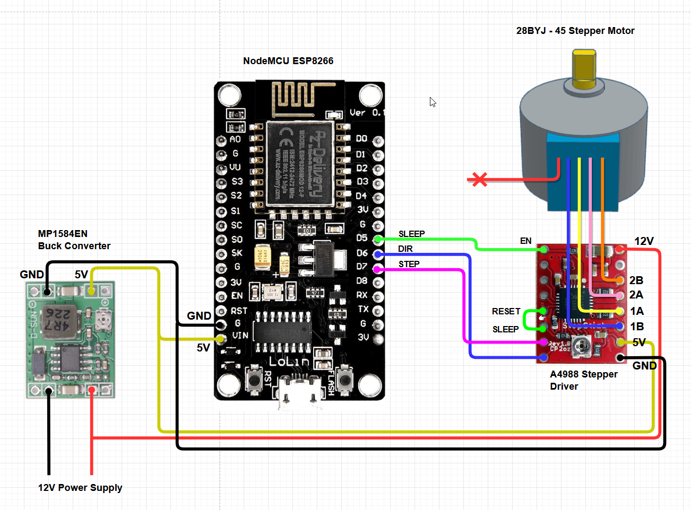
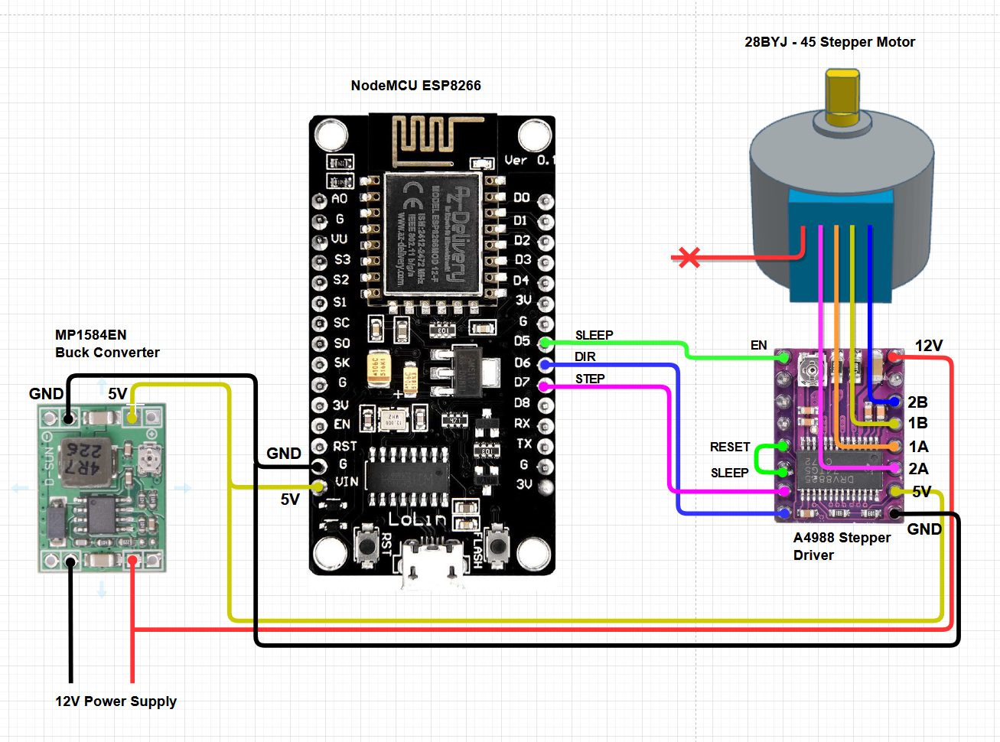
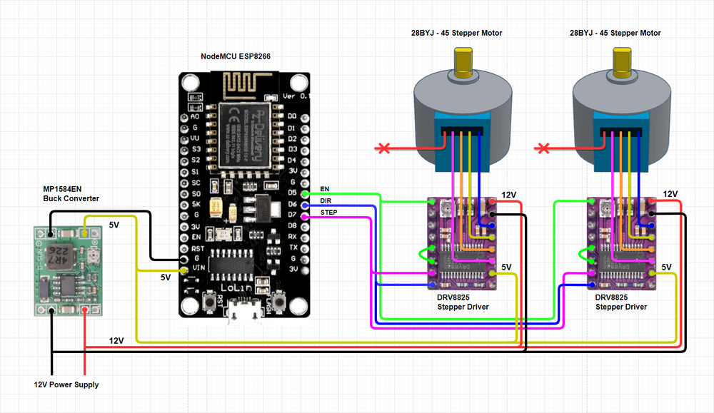

# Motorized Horizontal Blinds - Tilt Action

### TOC
* [Overview](#overview)
* [Overview](#parts)
* [Wiring Diarams](#wiring-diagrams)

### Overview

Motorizing and automating horizontal window blinds tilt with a stepper motor and ESP board using ESPHome, to be controlled from Home Assistant, NodeRED, and with Philips Hue Dimmer switches. 3D printed parts are needed to at least mount the motor to the blinds, additionally, you can print enclosures for the parts.

https://user-images.githubusercontent.com/98347572/186898839-479b3503-3003-47d2-b66b-1e4287295298.mp4

### Parts

* ESP8266 (D1 Mini, and NodeMCU)
* Stepper driver A4899 or DRV8825 (Note: pin layouts are slightly different)
* 28BYJ-45 stepper motor (5V) - converted to bipolar stepper
* MP1584EN Buck Converter
* 12V Power Supply
* 3D Printed parts: enclosure for the ESP and buck converter, adapter to attach the blind's axel to the motor. Mounting to attach the motor to the window frame and enclosure for the stepper driver.
* For wiring, I used an old cat6 ethernet cable

### Wiring Diagrams

Wiring for DRV8825 Stepper Driver

Wiring for A4988 Stepper Driver

Example of using two motors with two DRV8825 drivers

