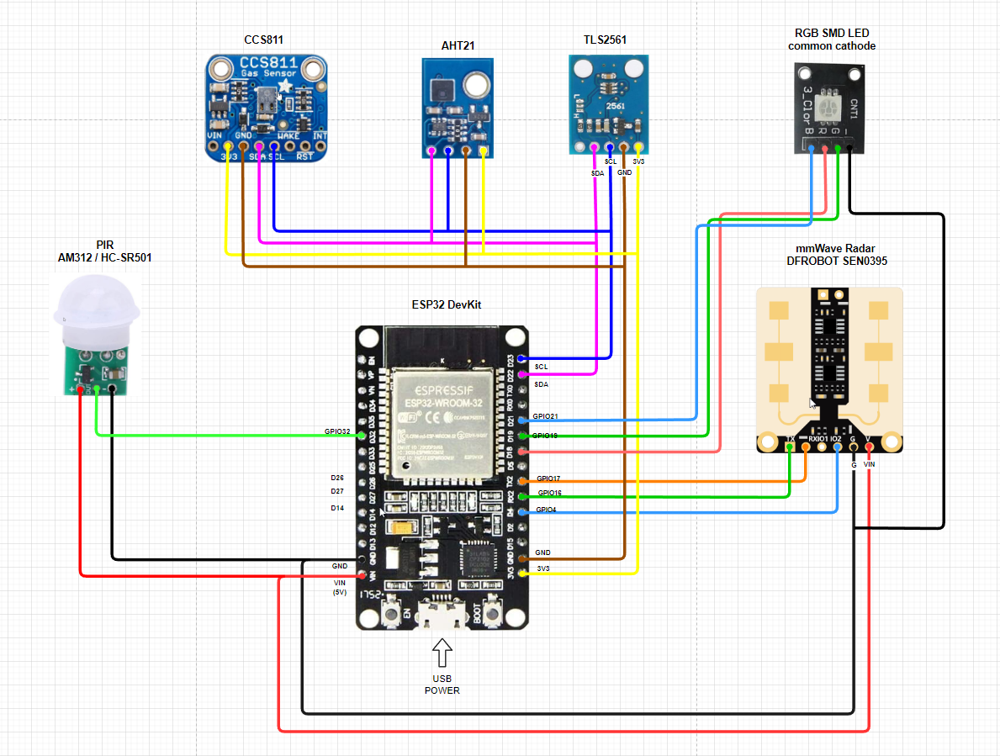

# Presence Box 2

Upgrades to the previous version [here](/esphome/presence)

## TOC
* [Diagram](#diagram)
* [Parts](#parts)
* 3D Printable Enclosures

## Parts

Notice that not all parts will fit simultaneously in to a one box.

* ESP32 DevKit v1 (fits in to the box stands)
* AM312 PIR or HC-SR501 PIR
* DFROBOT SEN0395 mmWave Radar
* TLS2561 Light Sensor
* AHT21 Temperature & Humidity Sensor
* CCS811 Air Quality Sensor (VOC & eCO2)
* 5mm RGB LED (common catode or anode) / RGB SMD LED
* DC plug (can be used for power instead of USB)
* Buck Converter?

## Diagram

Note! I don't have all the sensors in this currently in a same box, but the wiring is the same although different sensors in different places.

## Under the hood

