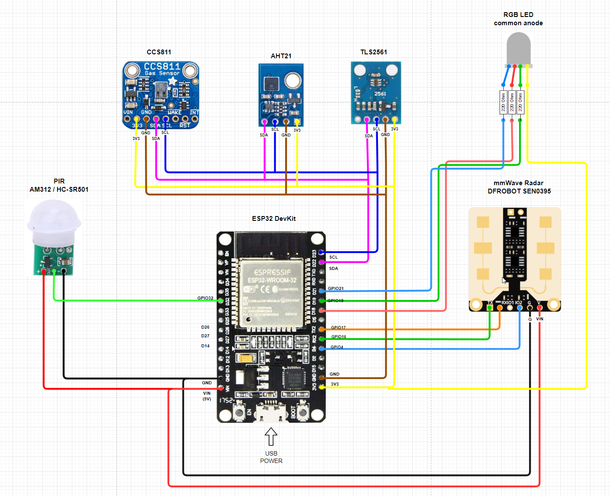
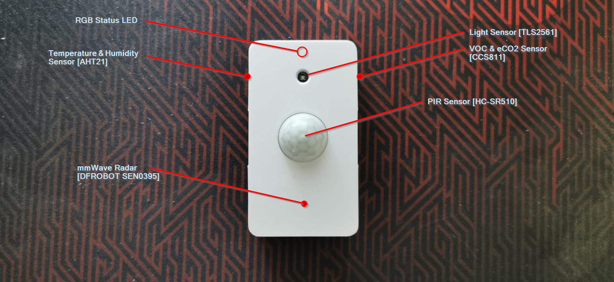
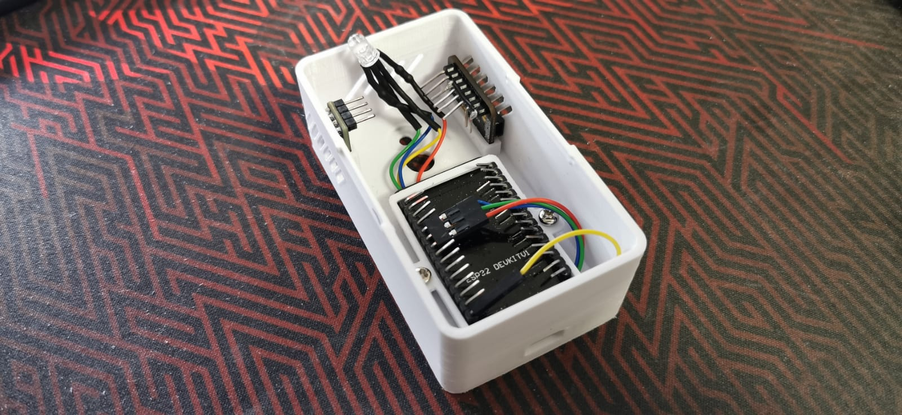
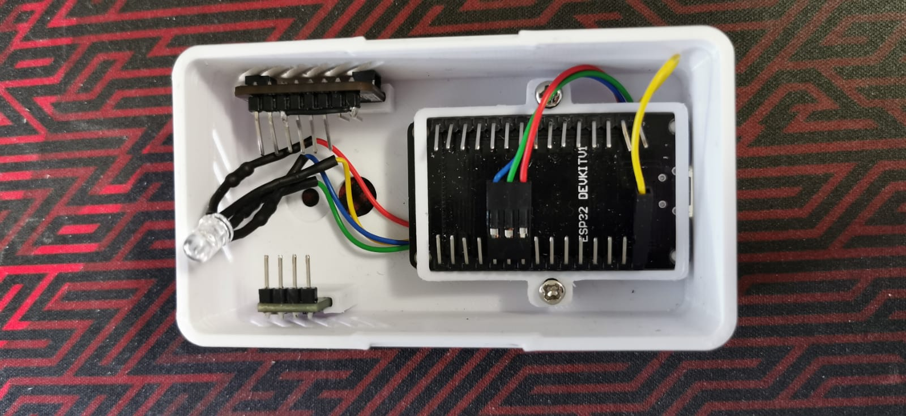
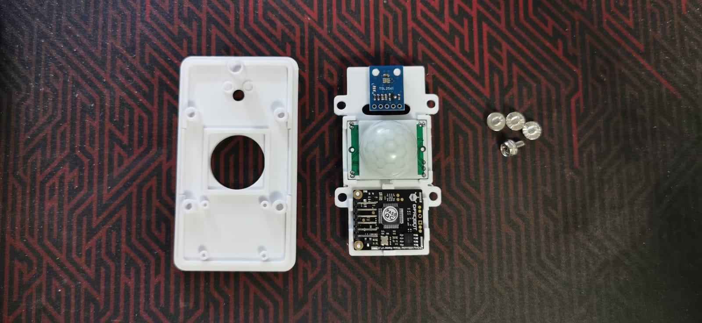

# Presence Box 2 (Work In Progress)

Upgrades to the previous version [here](/esphome/presence)

## TOC
* [Diagram](#diagram)
* [Parts](#parts)
* 3D Printable Enclosures
* ESPHome code

## Parts

Notice that not all parts will fit simultaneously in to a one box. Links below are mostly affiliate links so I may or may not get some small commission on purhaces, if I do, I will be using those to do other similar projects/content.

* [ESP32 DevKit](https://amzn.to/3Ry7VmC) (fits in to the box stands)
* [AM312 PIR](https://amzn.to/3KYUb22) or [HC-SR501 PIR](https://amzn.to/3d7cIwp)
* [DFROBOT SEN0395 mmWave Radar](https://www.mouser.fi/ProductDetail/426-SEN0395)
* [TLS2561 Light Sensor](https://amzn.to/3RTi0uu)
* [AHT21 Temperature & Humidity Sensor](https://amzn.to/3B1unxy)
* [CCS811 Air Quality Sensor (VOC & eCO2)](https://amzn.to/3DcLwXZ)
* [5mm RGB LED (focused)](https://amzn.to/3QwpZMH) / [5mm RGB LED (diffused)](https://amzn.to/3qvJVF6)
* [(OLED Display Module I2C SSD1306?)](https://amzn.to/3QwocqQ)
* [M3 Screws? - testing ..](https://amzn.to/3x9pdyv)

Optionally if powering from DC power supply, instead of USB

* [DC connectors](https://amzn.to/3Bt9GvW)
* [MP1584EN Step Down Converter](https://amzn.to/3B1uZ6k)

## Diagram

Note! I don't have all the sensors in this currently in a same box, but the wiring is the same although different sensors in different places.

## Under the hood

     
 
