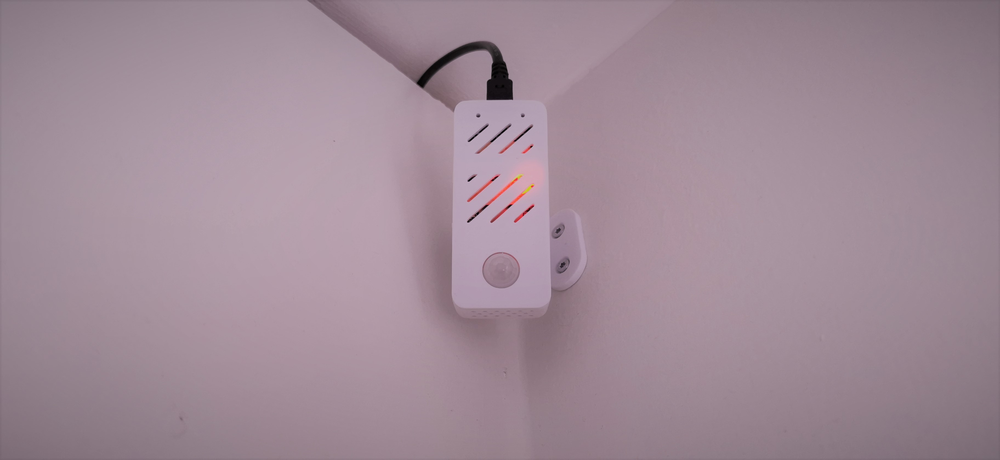
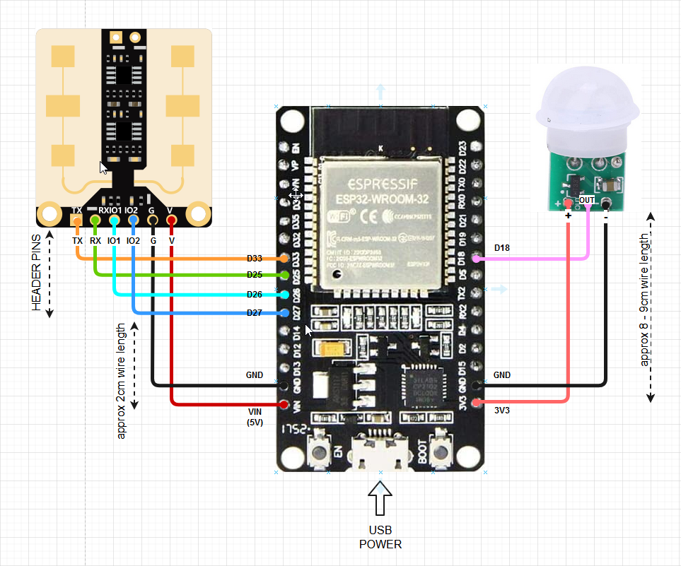
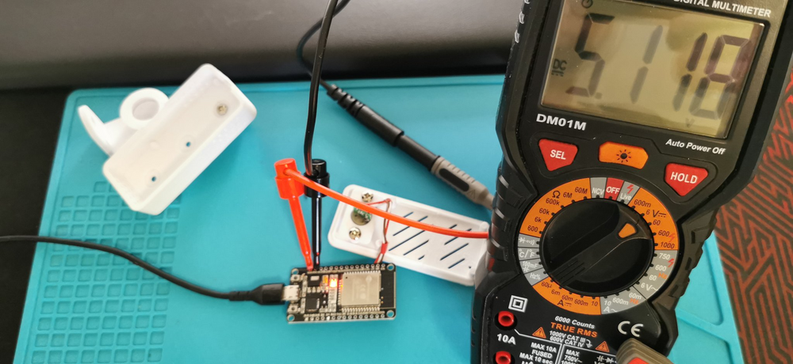

# Room Presence



## TOC
* [Overview](#overview)
* [Parts](#parts)
* [Wiring Diagram](#wiring-diagram)
* [USB Power](usb-power)
* [Build](#build)
* [Enclosure](#nclosure)
* [ESPHome](#esphome)

## Overview
Presence detection with PIR, mmWave radar and BLE Tracking. To make the enclosure as small as possible, I removed all headers from the PIR and from the ESP32.

## Parts
Parts which I used for this project
* [ESP32](https://www.amazon.de/-/en/gp/product/B08CCYWZN3/ref=sw_img_1?smid=A1RRESHOTNJOS4&psc=1)
* [AM312 IR sensor](https://www.amazon.de/-/en/gp/product/B08LBDYPYD/ref=ppx_od_dt_b_asin_title_s00?ie=UTF8&psc=1)
* [DFrobot SEN0395 mmWave Radar (2.4GHz)](https://www.dfrobot.com/product-2282.html)
* MicroUSB Power + Cable
* [Custom 3D Printed enclosure](https://www.tinkercad.com/things/5CkzC6C2VLl-esp32-pir-case-with-wall-mount)
* Wires to connect the parts
* Header rim for the mmWAve Radar

## Wiring Diagram



## USB Power
When powering the ESP from USB, you get 5V out from the VIN pin, which I used to power the mmWave radar sensor.


## Build

## Enclosure

## ESPHome

```YAML
esphome:
  name: kitchen-presence

esp32:
  board: esp32dev
  framework:
    type: arduino

# Enable logging
logger:

# Enable Home Assistant API
api:

# Over The Air updates
ota:
  password: !secret ota_password

# Connection to WiFi
wifi:
  ssid: !secret wifi_ssid
  password: !secret wifi_password

  # Enable fallback hotspot (captive portal) in case wifi connection fails
  ap:
    ssid: "kitchen-Presence"
    password: !secret ap_password

# MQTT client component
mqtt:
  broker: !secret mqtt_ip
  username: !secret mqtt_username
  password: !secret mqtt_password
  discovery: False # Only if you use the HA API usually
  id: mqtt_client
  
substitutions:
  room_name: bedroom

globals:
  - id: room_topic
    type: std::string
    initial_value: '"room_presence/${room_name}"'

# Enable BLE tracker
esp32_ble_tracker:
  on_ble_advertise:
    - then:
      - mqtt.publish_json:
          topic: 'room_presence/${room_name}'
          payload: |-
            root["id"]=x.address_str();
            root["name"]=x.get_name();
            root["rssi"]=x.get_rssi();
            # adjusted TX Power for Oura
            root["distance"]=pow(10, (float)(-81 - x.get_rssi()) / (10 * 2));

# fallback if WiFi fails
captive_portal:

web_server:
  port: 80
  version: 2
  include_internal: true
  auth:
    username: !secret web_user
    password: !secret web_pass

# Enable HTTP/HTTPS requests
http_request:
  # default ESPHome
  useragent: esphome/$device_name
  # request time out / default 5s
  timeout: 2s

# UART communication settings for mmWave sensor | Remember to set pins
uart:
  id: uart_bus
  # pin to send data from ESP
  tx_pin: GPIO25
  # pin to receive data to ESP
  rx_pin: GPIO26
  # baud rate for UART bus (required)
  baud_rate: 115200
  debug:
    # debug communication to both directions
    direction: BOTH
    # useful to debug all incoming communication
    dummy_receiver: true
    after:
      delimiter: "\n"
    sequence:
      - lambda: UARTDebug::log_string(direction, bytes);


switch:

    # Switch for Safe Mode
  - platform: safe_mode
    internal: true
    name: use_safe_mode


binary_sensor:

  # mmWave Sensor | remember to set the pin
- platform: gpio
  name: kitchen_mmwave
  pin:
    number: GPIO27
    mode: INPUT_PULLDOWN

  # PIR Sensor | remember to set the pin
- platform: gpio
  name: kitchen_pir
  id: kitchen_pir
  pin:
    number: GPIO18
    mode: INPUT_PULLDOWN
  # delay detection off by 3s
  filters:
    - delayed_off: 3s

  # Jukka Oura Gen3 BLE sensor
- platform: ble_presence
  mac_address: 'xx:xx:xx:xx:xx:xx'
  name: "Jukka Oura Kitchen"
  
  # Piia Oura Gen2 BLE sensor
- platform: ble_presence
  mac_address: 'xx:xx:xx:xx:xx:xx'
  name: "Piia Oura"
  

sensor:

  # Jukka Oura Gen3 RSSI sensor value
- platform: ble_rssi
  mac_address: 'xx:xx:xx:xx:xx:xx'
  name: "Jukka Oura RSSI kitchen"

  # Piia Oura Gen2 RSSI sensor value
- platform: ble_rssi
  mac_address: 'xx:xx:xx:xx:xx:xx'
  name: "Piia Oura RSSI kitchen"
  
  # Anton FitBit RSSI sensor value
- platform: ble_rssi
  mac_address: 'xx:xx:xx:xx:xx:xx'
  name: "Anton FitBit RSSI kitchen"


number:

    ## SENSING DISTANCE value for mmWave Radar
  - platform: template
    # name for the number (required)
    name: kitchen_distance
    # ID for code generation (optional)
    id: kitchen_distance
    # Min & Max values for the distance slider (required)
    min_value: 0 # Default, if initial_value is not set
    max_value: 1350
    # default number (sensing distance) value in cm
    initial_value: 315
    # When TRUE any command sent to the template number will immediately update the reported state.
    optimistic: true
    # Slider changes the number (sensing distance) value in steps of 15cm
    step: 15
    # Saves and loads the state to RTC/Flash
    restore_value: true
    # Unit
    unit_of_measurement: cm
    # Action to be performed when requested from frontend
    set_action:
    	# STOP the sensor first
      - uart.write: "sensorStop"
      	# Wait for 1 sec for the sensor to stop
      - delay: 1s
      	# Write the new sensing distance value to the sensor detRangeCfg
      - uart.write: !lambda
                      int cm = (int)ceil(x / 15.0);
                      std::string cms = "detRangeCfg -1 0 " + to_string(cm);
                      return std::vector<unsigned char>(cms.begin(), cms.end());
        # Wait for 1 sec for the write
      - delay: 1s
      	# When parameters are reconfigured through UART and not saved, this command (Fixed values) saves the new configuration parameters to the sensor Flash
        # saveCfg par1 par2 par3 par4
      - uart.write: "saveCfg 0x45670123 0xCDEF89AB 0x956128C6 0xDF54AC89"
      	# Wait for 1 sec for the write
      - delay: 1s
      	# START the sensor again
      - uart.write: "sensorStart"

    ## LATENCY FOR TURNING mmWave OFF when no movement detected.
  - platform: template
    name: kitchen_latency
    id: kitchen_latency
    # Min & Max values for the latency slider (required) in ms
    min_value: 0
    max_value: 65000
    # default number (latency) value in ms
    initial_value: 12500
    # When TRUE any command sent to the template number will immediately update the reported state.
    optimistic: true
    step: 25
    # Saves and loads the state to RTC/Flash
    restore_value: true
    unit_of_measurement: ms
    set_action:
    	# STOP the sensor first
      - uart.write: "sensorStop"
      - delay: 1s
      - uart.write: !lambda
                      int ms = (int)ceil(x / 25.0);
                      std::string mss = "outputLatency -1 0 " + to_string(ms);
                      return std::vector<unsigned char>(mss.begin(), mss.end());
      - delay: 1s
      	# When parameters are reconfigured through UART and not saved, this command (Fixed values) saves the new configuration parameters to the sensor Flash
        # saveCfg par1 par2 par3 par4
      - uart.write: "saveCfg 0x45670123 0xCDEF89AB 0x956128C6 0xDF54AC89"
      - delay: 1s
      	# START the sensor again
      - uart.write: "sensorStart"   

button:
    # Restart the device
  - platform: restart
    name: restart_kitchen_radar

    # Reset mmWave sensor configuration parameters to Factory defaults
  - platform: template
    name: "factory_reset_kitchen_dfrobot"
    id: "factory_reset_kitchen_dfrobot"
    on_press:
    	# STOP the sensor first
      - uart.write: "sensorStop"
      - delay: 1s
      	# reset command (fixed values)
      - uart.write: "factoryReset 0x45670123 0xCDEF89AB 0x956128C6 0xDF54AC89"
      - delay: 3s
      	# START the sensor again
      - uart.write: "sensorStart"
```
