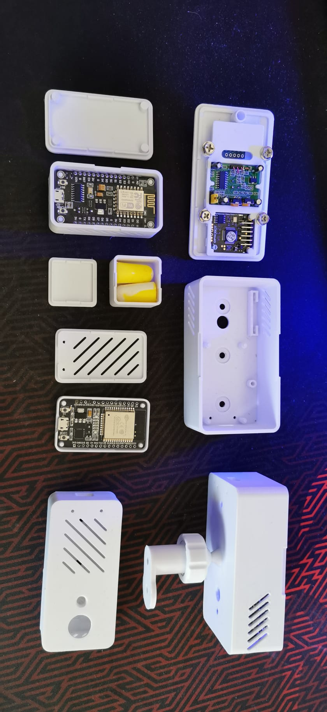
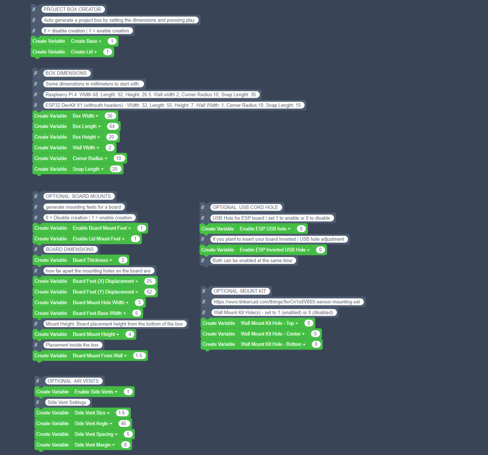
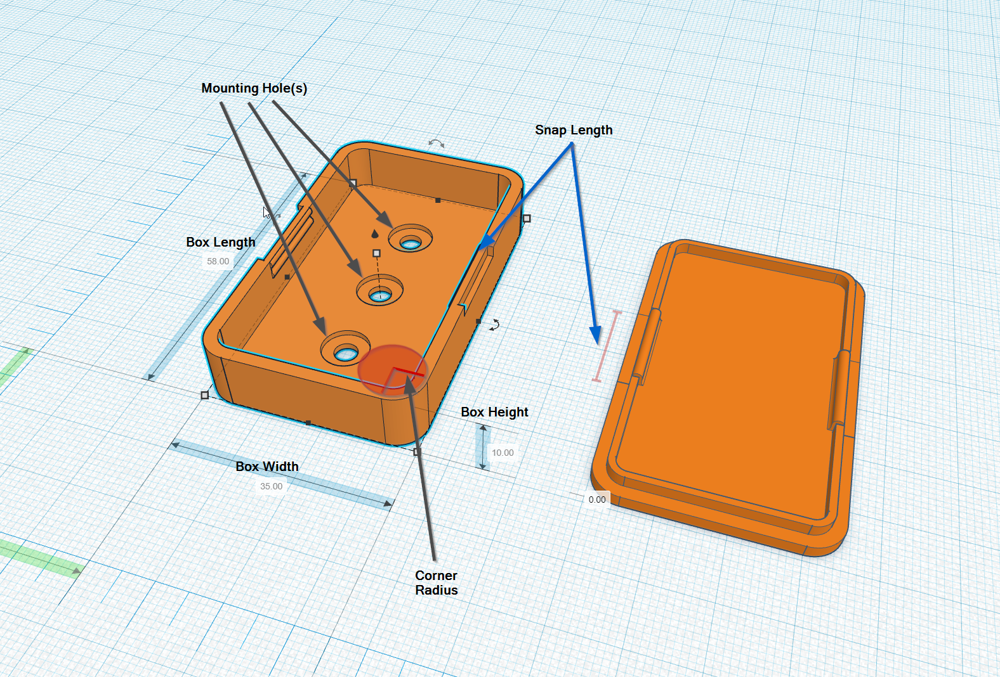
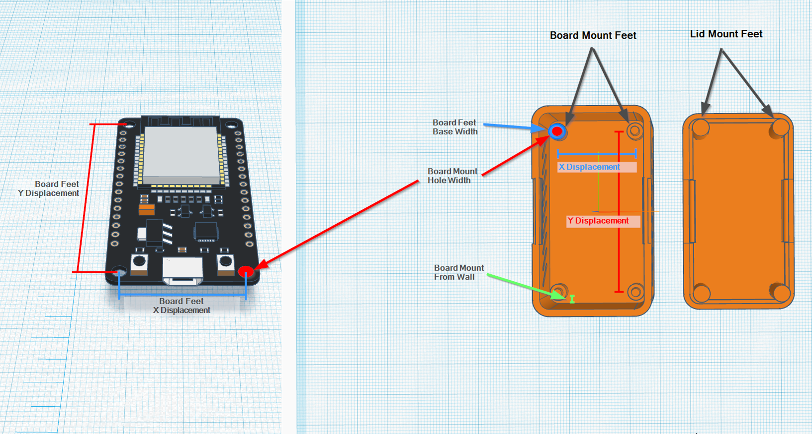
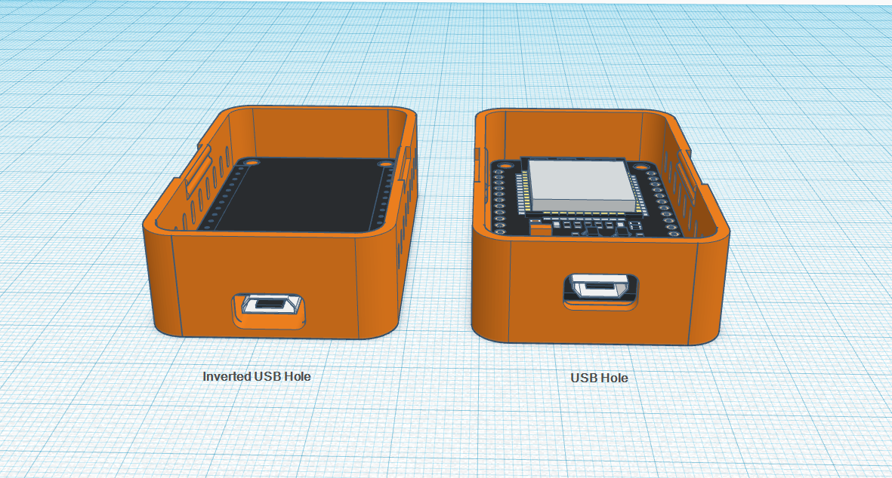
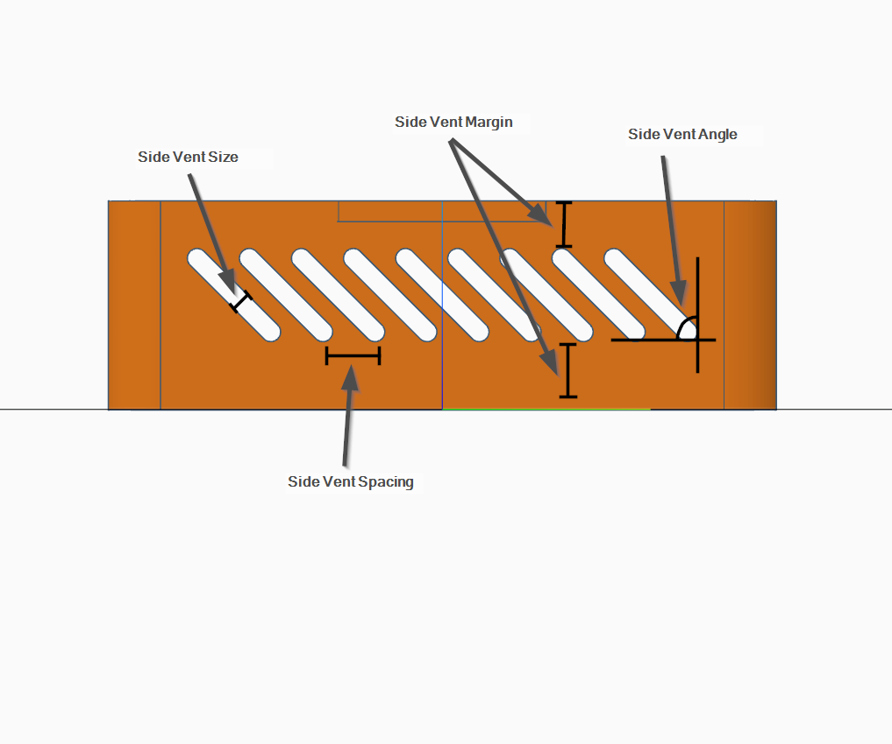
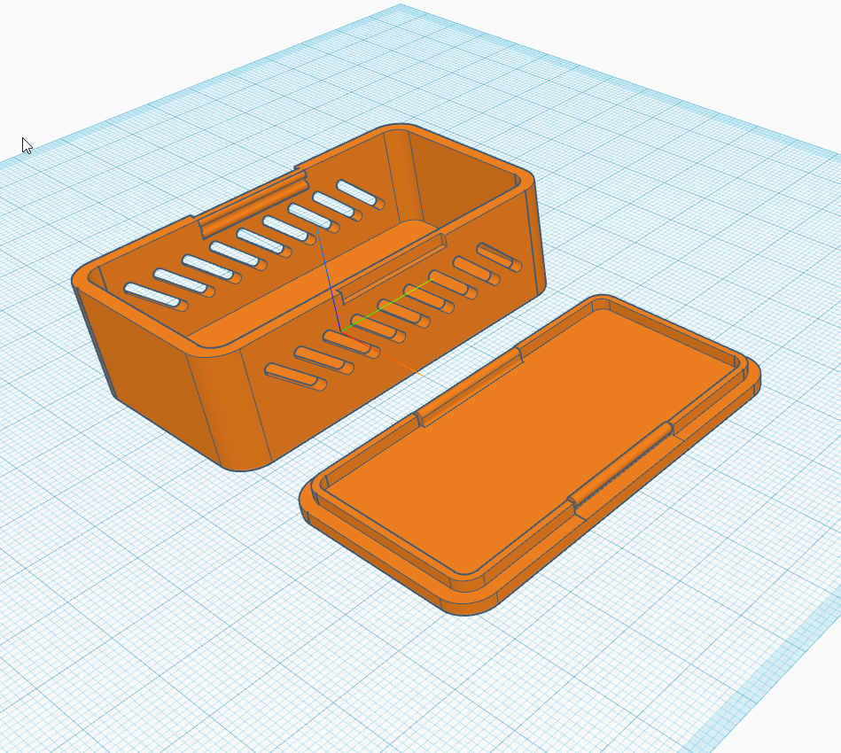
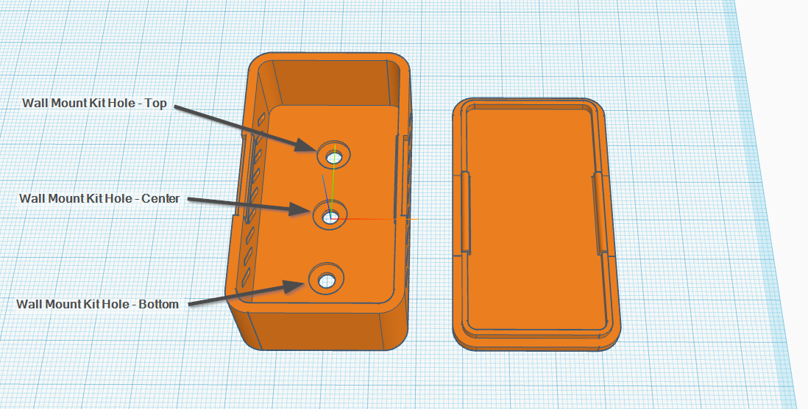
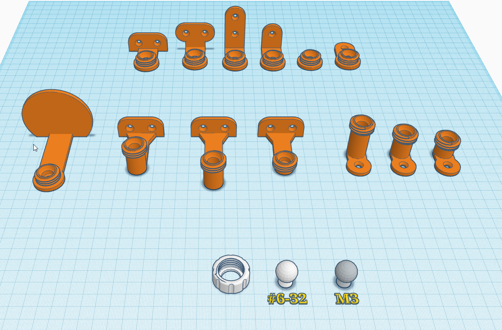
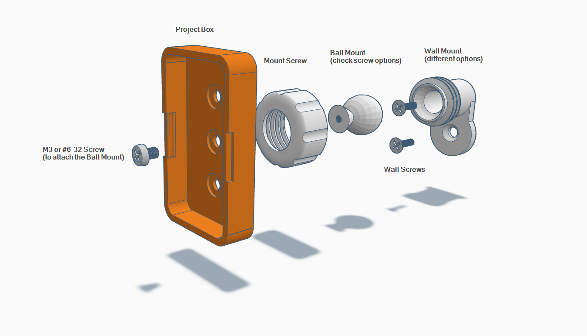

# Project Box Creator

* [Project Box Creator (TinkerCad)](https://www.tinkercad.com/codeblocks/4ruEYPK78RS)
* [Mount Kit (TinkerCad)](https://www.tinkercad.com/things/9wCn1o8V80X) | [Mount Kit (Printables)](https://www.printables.com/model/277210-mount-kit)

Some generated examples (some are post modified in TinkerCad)

The separate Box base and Lid codeblocks are still available here, but I won't be updating those anymore.

* [Project Box Lid Creator](https://www.tinkercad.com/codeblocks/gjlQFVI1M6F)
* [Projects Box Base Creator](https://www.tinkercad.com/codeblocks/9GnrfRpp1H1)

## TOC

Project Box Creator

* [Overview](#overview)
* [Box Creation Options](#box-creation-options)
* [Box Dimensions](#box-dimensions)
* [Board Mount Settings](#board-mount-settings)
* [USB Cord Hole](#usb-cord-hole)
* [Air Vent Settings](#air-vent-settings)
* [Box Mount Kit Settings](#box-mount-kit-settings)

Mount Kit
* [Wall Mount Options](#wall-mount-options)
* [Wall Mount Instructions](#wall-mount-instructions)

## Overview

I wanted to make it as easy as possible to start experimenting with new 3D printable project boxes. I thought I'd parametrize my previous designs with TinkerCad Codeblocks, and for my needs it works really well.

My wall mount kit works also pretty well with the boxes, naturally depends on your box dimensions in the end how well it fits.

## Box Creation Options

NOTE 1: *Before you do anything else you want to set the TinkerCad Codeblocks speed setting to Max (on the top/right corner side) or else you will be waiting FOREVER the box to generate.*

NOTE 2: *When you open the TinkerCad Codeblocks, you may need to scroll to the top to actually see the correct variables that you can changes.* Although I have tried to set comment boxes around the "canvas" so that it centers the variables when first opened.

### Box Dimensions

The box dimensions are the external dimensions, if you need to specifically fit something inside, calculate the internal volume you need. Reduce the wall width from both sides, both ends, and from top and bottom to get the internal volume, measure accordingly.

**All dimensions are in millimeters (mm)**

* Box Width (*external width*)
* Box Length (*external length*)
* Box Height (*external height*)
* Wall Width
* Corner Radius
* Snap Length (*snap-in mechanism length on the sides*)

### Board Mount Settings

Optional settings for mounting a boards like ESP32s, Raspberry Pis etc. If you don't need the board mounting just leave leave the "board mount variables" to 0 (disabled)
* Enable Board Mount Feet
* Enable Lid Mount Feet

*Note: If your Lid Mount Feet appear to be outside of the Lid inner wall, then you won't be able close the lid (small overlapping with the wall is probably is still fine), and need to make the box a bit bigger.*

### USB Cord Hole

(For ESP devices)

In most cases you will want to add the cord hole(s) separately, modifying the shape. I anyway included this more for my own convinience, having tested it only with ESP32 DevKit V1 and ESP8266 NodeMCU V3, so use with care, or atleast check/test with shapes before printing.

Ideally when you have the board mount feet enabled, you want the USB cord hole to power your board. Depending how you are placing you board you might want to "inverted the hole placement".

There is currently a problem with the inverted USB hole, not being placed correctly in all cases .. working to fixing it.

### Air Vent Settings

Optional settings for having air vents on the sides of the box. If you don't want any holes in the box side walls, just leave this setting to 0 (disabled)
* Enable Side Vents

Leaving the *Side Vent Margin* and *Side Vent Angle* both to 0 at the same time, will overlap with the snap-in mechanism, and probably end up affecting it, so check that you have enough margin from the edges of the box.

Depending on the *Box Length*, *Side Vent Spacing* and the *Side Vent Angle* the box sides will automatically be fitted with as many vents as possible ("within safety margins") :).

The Vents are centered to the box height with the Lid on, so they may look offcenter with just the base.

   
 

### Box Mount Kit Settings

There are 3 different positions for the mount kit, you can enable each individually, all, or none. Depending on the box placement, you may get a better ranges with some of the options.

To use the mount kit you need an M3 screw or a #6-32 screw (standard computer case screw), and what ever wall screws you may need.

## Mount Kit

### Wall Mount Options

### Wall Mount Instructions

