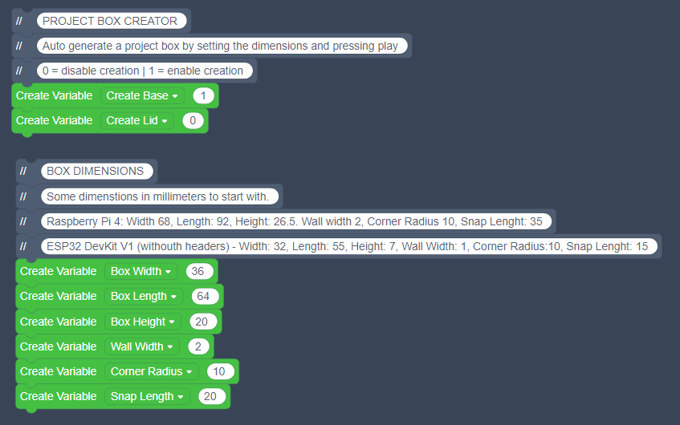

# Project Box Creator

### Overview

I wanted to make it as easy as possible to start experimenting with new 3D printable project boxes. I thought I'd parametrize my previous designs with TinkerCad Codeblocks, and for my needs it works really well.

My wall mount kit works also pretty well with the boxes, naturally depends on your box dimensions in the end how well it fits.

## Box Creation Options

### Basic Settings

*NOTE: When you open the TinkerCad Codeblocks, you may need to scroll to the top to actually see the correct variables that you can changes.*

**Set Box Dimensions**

The box dimensions are the outside dimensions, if you need to specifically fit something inside, reduce the wall width from both sides, both ends, and from top and bottom to get the internal volume, measure accordingly.

**All dimensions are in millimeters (mm)**

* Box Width
* Box Length
* Box Height
* Wall Width
* Corner Radius
* Snap Length (snap-in mechanism length on the sides)

### Board Mount Settings

### Box Mount Kit Settings

There are 3 different positions for the mount kit, you can enable each individually, all, or none.

* Wall Mount Kit Hole - Top
* Wall Mount Kit Hole - Center
* Wall Mount Kit Hole - Bottom
