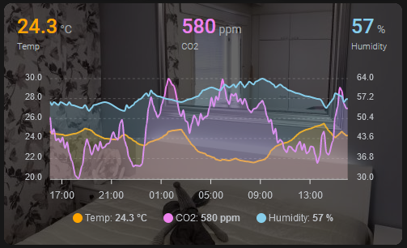

# ApexCharts Card
I use the [ApexCharts Card by RomRider ](https://github.com/RomRider/apexcharts-card) quite a lot, I like it how it can be customized to almost what ever I need. Note that for [apexcharts-card](https://github.com/RomRider/apexcharts-card) there are some features/customizations that are not in the documents but can be used from the [apexcharts.js docs](https://apexcharts.com/docs/) by using the apex_config, this can need some experimenting though.

### TOC

* [ApexCharts with background image](#apexcharts-with-background-image)
* [Multiple ApexCharts In A Swipe Card](#multiple-apexcharts-in-a-swipe-card)

## ApexCharts with background image


Using card_mod and css to add and position a background image. The box-shadow adds an 60% shadow overlay on top of the image to make the graph more visible.

See [apexcharts-with-background.yaml](apexcharts-with-background.yaml) for full YAML

```YAML
type: custom:apexcharts-card
card_mod:
  style: |
    ha-card {
# background image URL
      background-image: url("/local/room_bedroom.jpg");
      
# centering the background image
      background-position: center;
      
# Resizing the image for the card view
      background-size: 130%
      
# dimming the background with box-shadow
      box-shadow: inset 0 0 0 1000px rgba(0,0,0,.6);
      
# "dirty" adjustment with padding
      padding-top: 10px;
    }
...
```

In my room card I am using the chart without header or legend values, since I implemented other cards to show the values either all the time or if set threshold are triggered. Anyway the header and/or the legend values are easy to enable in the config.



## Multiple ApexCharts In a Swipe Card

If you have multiple charts on your dashboard, but do not nessarily need to monitor them all at once you can save some screen space and put them on a swipe card and set it on autoplay, and stop it if interacted with.


```YAML
type: custom:swipe-card
# which card is shown first
start_card: 1
parameters:
# If you want to show navigation arrows, uncomment the line 'navigation: null'
#  navigation: null
  navigation: null
  autoplay:
# this will disable autoplay if interacted with.
    disableOnInteraction: true
# Time to show one chart
    delay: 5000
  scrollbar:
    hide: false
    draggable: true
    snapOnRelease: false
cards:
```

And then adding ApexCharts ..

```YAML
  - type: custom:apexcharts-card
    style: |
      ha-card {
        padding-top: 10px;
        background-image: url("/local/rooms/room_livingroom_3.jpg");
        background-position: center;
        background-size: 130%;
        box-shadow: inset 0px 0px 0px 1000px rgba(0,0,0,.6);
      }
    graph_span: 24h
    show:
      loading: false
    apex_config:
      chart:
        height: 160px
      grid:
        show: true
        borderColor: rgba(255,255,255,0.2)
      legend:
        show: false
    header:
      show: true
      show_states: true
      colorize_states: true
      standard_format: true
    all_series_config:
      stroke_width: 2
    yaxis:
      - id: temp
        show: true
        min: ~20
        max: ~25
        apex_config:
          tickAmount: 5
          labels:
            show: true
          title:
            text: TEMP
            style:
              color: orange
      - id: humidity
        show: true
        opposite: true
        min: ~35
        max: ~45
        apex_config:
          tickAmount: 5
          labels:
            show: true
          title:
            text: HUMIDITY
            style:
              color: skyblue
    series:
      - entity: sensor.airthings_wave_plus_temperature
        yaxis_id: temp
        type: area
        opacity: 0.2
        name: Temp
        color: orange
        show:
          legend_value: false
      - entity: sensor.airthings_wave_plus_humidity
        yaxis_id: humidity
        type: area
        opacity: 0.2
        name: Humidity
        color: skyblue
        show:
          legend_value: true
  - type: custom:apexcharts-card
    style: |
      ha-card {
        padding-top: 10px;
        background-image: url("/local/rooms/room_livingroom_3.jpg");
        background-position: center;
        background-size: 130%;
        box-shadow: inset 0px 0px 0px 1000px rgba(0,0,0,.6);
      }
    graph_span: 24h
    show:
      loading: false
    apex_config:
      chart:
        height: 160px
      grid:
        show: true
        borderColor: rgba(255,255,255,0.2)
      legend:
        show: false
    header:
      show: true
      show_states: true
      colorize_states: true
      standard_format: true
    all_series_config:
      stroke_width: 2
    yaxis:
      - id: co2
        opposite: false
        min: ~400
        max: ~900
        show: true
        apex_config:
          tickAmount: 5
          labels:
            show: true
          title:
            text: CO2
            style:
              color: violet
      - id: voc
        show: true
        opposite: true
        min: ~0
        max: ~800
        apex_config:
          tickAmount: 5
          labels:
            show: true
          title:
            text: VOC
            style:
              color: orange
    series:
      - entity: sensor.airthings_wave_plus_co2
        yaxis_id: co2
        type: area
        opacity: 0.2
        name: CO2
        color: violet
        show:
          legend_value: true
      - entity: sensor.airthings_wave_plus_voc
        yaxis_id: voc
        type: area
        opacity: 0.2
        name: VOC
        color: orange
        show:
          legend_value: false
```
