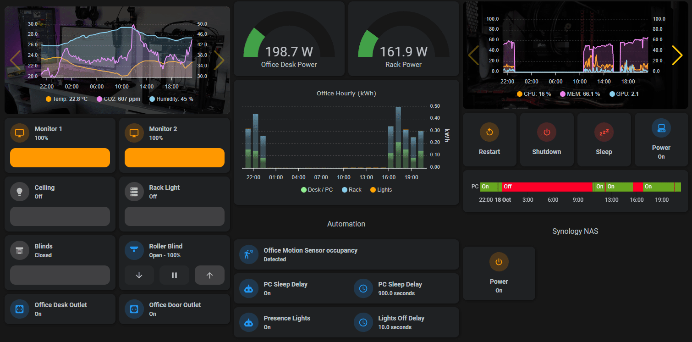

# Automation Delay Visualization

While adding some presence based automation and parametrization for them, like delays for turning off devices and lights, for testing purposes I wanted to see some visualization how the delay progresses. But I ended up liking so much that I fine tuned it to be part of my dashboards.

## Helpers

For each automation to visualize, I used 3 helpers

* input_boolean - to turn the automation on/off (in Node-RED)
* input_number - in secconds to define the delay, when to turn off the device, after no presence in the room.
* timer - timer is used to visualize the delay.

## Visualization

For the visualization I used [timer-bar-card](https://github.com/rianadon/timer-bar-card) with a grid and mushroom-entity cards which show the input_boolean and input_number helpers.
