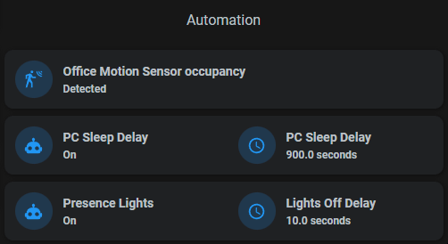
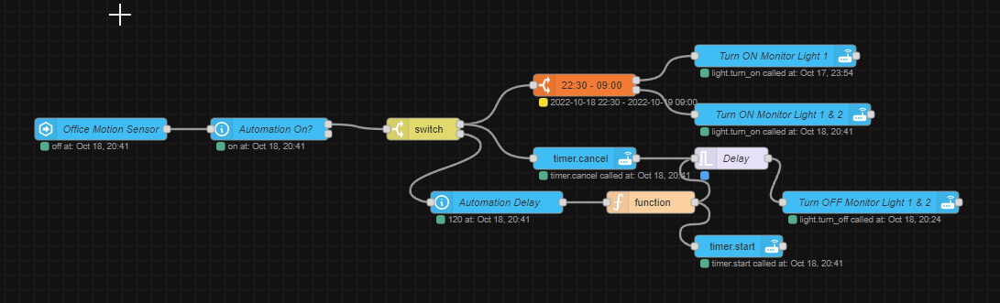

# Automation Delay Visualization

While adding some presence based automation and parametrization for them, like delays for turning off devices and lights, for testing purposes I wanted to see some visualization how the delay progresses. But I ended up liking so much that I fine tuned it to be part of my dashboards.


## Helpers

For each automation to visualize, I used 3 helpers

* input_boolean - to turn the automation on/off (in Node-RED)
* input_number - in secconds to define the delay, when to turn off the device, after no presence in the room.
* timer - timer is used to visualize the delay.

## Dashboard Visualization



For the visualization I used [timer-bar-card](https://github.com/rianadon/timer-bar-card) with a grid and mushroom entity cards which show the input_boolean and input_number helpers.

```YAML
type: custom:stack-in-card
mode: vertical
cards:
  - type: grid
    square: false
    columns: 2
    cards:
      - type: custom:mushroom-entity-card
        entity: input_boolean.office_automation_presense_lights
        name: Presence Lights
        icon: mdi:robot
        card_mod:
          style: |
            ha-card {
              z-index: 5;
            }
      - type: custom:mushroom-entity-card
        entity: input_number.office_automation_presence_lights_delay
        name: Lights Off Delay
        card_mod:
          style: |
            ha-card {
              z-index: 5;
            }
  - type: custom:timer-bar-card
    entities:
      - timer.office_automation_presence_lights_timer
    invert: true
    bar_height: 2px
    bar_foreground: orange
    bar_background: '#111'
    layout: full_row
    text_width: 0px
    bar_width: 80%
    card_mod:
      style: |
        ha-card {
          height: 4px;
          margin-top: -40px;
          margin-bottom: -25px;
          padding: 0px;
          z-index: 1;
        }

```

## Automation (Node-RED)


