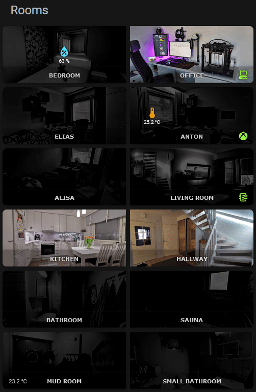

# Rooms Overview

I have one dashboard where I have an overview of all the other dashboards, one component on this dashboard is an overview to all rooms. It shows where lights are on, what devices or appliances are on, room presence, air quality alerts and other alerts (depending on the room). Each room card acts as a navigation element to the room dashboard.

