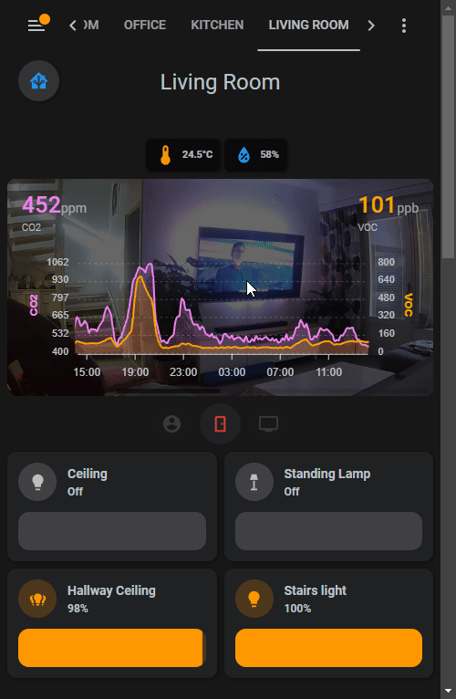

# Sticky Top Card

I use this for all my room dashboard to show the room name and a button for quick navigation back to the home overview.



Wrapped in a *stack-in-card*

```YAML
type: custom:stack-in-card
cards:
```

there is a *mushroom-template-card* for the title, and styling for it.

```YAML
  - type: custom:mushroom-template-card
    primary: Living Room
    secondary: ''
    icon: ''
    icon_color: blue
    layout: vertical
    multiline_secondary: false
    card_mod:
      style: |
        :host {
          padding-top: 5px;
          --mush-card-primary-font-size: 24px;
          --mush-card-primary-font-weight: normal;
          background: rgb(23, 23, 23, 1);
        }
````

Next is a *mushroom-chips-card* as a home navigation button

```YAML
  - type: custom:mushroom-chips-card
    chips:
      - type: template
        double_tap_action:
          action: none
        icon: mdi:home-assistant
        icon_color: blue
        tap_action:
          action: navigate
          navigation_path: home
        hold_action:
          action: none
        card_mod: null
        style: |
          :host {
            margin-top: 0px;
            padding-top: 0px;
            position: absolute;
            top: -54px;
            left: 12px;
            z-index: 999;
            --chip-height: 45px;
            --chip-background: #333;
            --chip-border-radius: 30px;
          }
```

and for the *stack-in-card*, making it sticky and some styling

```YAML
card_mod:
  style: |
    :host {
      z-index: 999;
      position: sticky;
      position: -webkit-sticky;
      top: 65px;

    }
    ha-card {
      top: -10px;
      margin: 0px;
      padding-top: 0px;
      background: rgb(23, 23, 23, 0);
      box-shadow: none;
      height: 80px;
      border-radius: 0px;
    }
```

