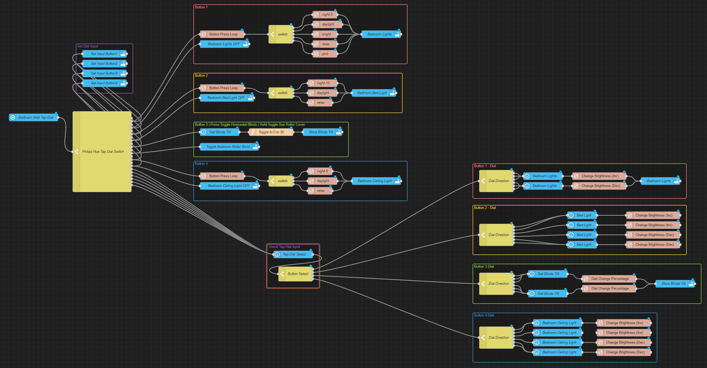
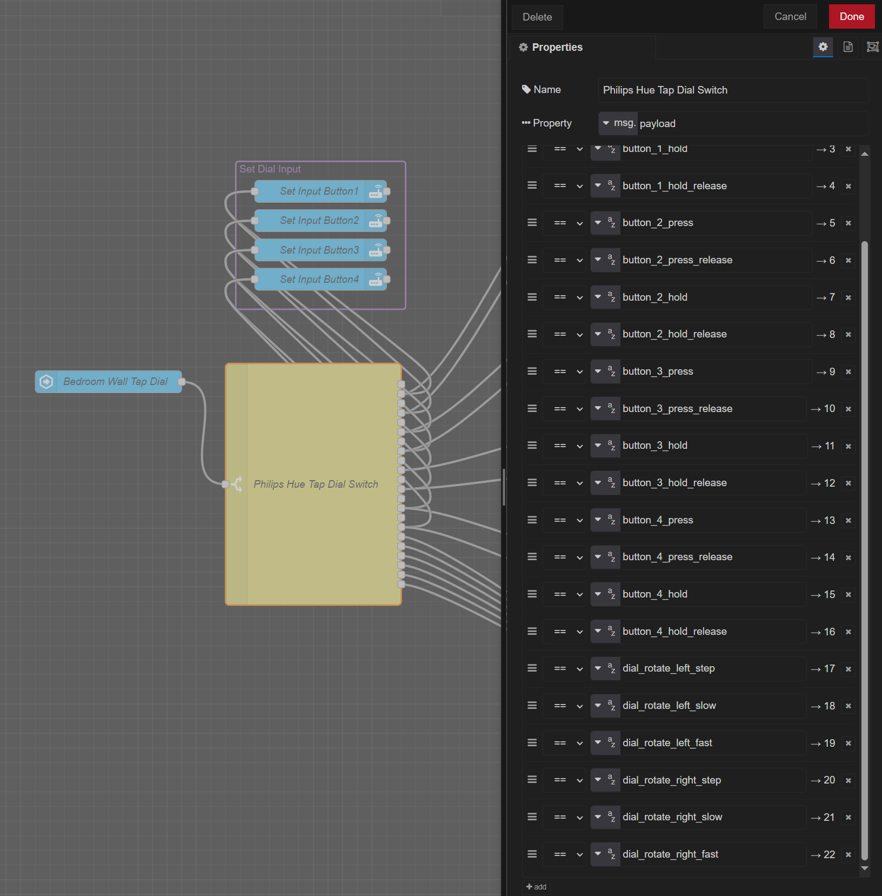

# Hue Tap Dial Switch



## Overview
I have set my light switches so that multiple presses on the buttons change the scene of the light(s) that are linked to that button and holding the same button turns the linked light(s) off.

When any of the buttons are pressed, the dial is activated to the light(s) that is "linked" to that button. So the dial can be used to dim the light which button was last pressed.

## instructions

This needs an input_select helper entity. With this helper you can use the dial to control four different entities. When you push button number 1, the entity_select is set to button1, and you can use that information to control an entity. If you push button number 2 you can now use the dial to control second entity.

### Functions
The *Button Press Loop* function mimics Philips Hue multipress actions. Depending how many times a button is pressed a different action is taken. Only the Button Press Loop you can set your self how many pressesn you want to activate. You have to modify the switch element to match the number of actions you want to output. And there is a time, which after the output resets back to 1.

*Change Brightness* outputs a number between 0-100, it the settings you can set the step and if the output number is decreasing or increasing with every input.

## Node-Red Diagrams & JSON

Breaking done the different parts

### Philips Hue Tap Dial Switch (Button Presses Switching to different outputs)

Diagram:


This node splits the button pressactions from the Tap Dial entity to different outputs. When any of the buttons are presses (can be a press or a hold press) the last button pressed will be stored into the selection list on release. This stored information of the last pressed button will be then used to activate different actions for the dial.

JSON:
```
[{"id":"aef4a30dc44bbd8e","type":"switch","z":"dd968b7cf8b8e6f5","name":"Philips Hue Tap Dial Switch ","property":"payload","propertyType":"msg","rules":[{"t":"eq","v":"button_1_press","vt":"str"},{"t":"eq","v":"button_1_press_release","vt":"str"},{"t":"eq","v":"button_1_hold","vt":"str"},{"t":"eq","v":"button_1_hold_release","vt":"str"},{"t":"eq","v":"button_2_press","vt":"str"},{"t":"eq","v":"button_2_press_release","vt":"str"},{"t":"eq","v":"button_2_hold","vt":"str"},{"t":"eq","v":"button_2_hold_release","vt":"str"},{"t":"eq","v":"button_3_press","vt":"str"},{"t":"eq","v":"button_3_press_release","vt":"str"},{"t":"eq","v":"button_3_hold","vt":"str"},{"t":"eq","v":"button_3_hold_release","vt":"str"},{"t":"eq","v":"button_4_press","vt":"str"},{"t":"eq","v":"button_4_press_release","vt":"str"},{"t":"eq","v":"button_4_hold","vt":"str"},{"t":"eq","v":"button_4_hold_release","vt":"str"},{"t":"eq","v":"dial_rotate_left_step","vt":"str"},{"t":"eq","v":"dial_rotate_left_slow","vt":"str"},{"t":"eq","v":"dial_rotate_left_fast","vt":"str"},{"t":"eq","v":"dial_rotate_right_step","vt":"str"},{"t":"eq","v":"dial_rotate_right_slow","vt":"str"},{"t":"eq","v":"dial_rotate_right_fast","vt":"str"}],"checkall":"true","repair":false,"outputs":22,"x":440,"y":3500,"wires":[[],["5c1aec931929066c","3b5fd3c89a3a139e"],[],["ca09ed5b245c57b3","3b5fd3c89a3a139e"],[],["4c85ff060aaf7175","d37a0aecbf51f32a"],[],["d37a0aecbf51f32a","ef9abeffd2d6389f"],[],["180fd03035351d65","9591bcada6112436"],[],["180fd03035351d65","eb799d2e50a94d11"],[],["e2c2ba9c3214f61a","95a34393987902e5"],[],["e2c2ba9c3214f61a","3c2f59d8760fff37"],["a18fa3c95d6da005"],["a18fa3c95d6da005"],["a18fa3c95d6da005"],["a18fa3c95d6da005"],["a18fa3c95d6da005"],["a18fa3c95d6da005"]]},{"id":"e2c2ba9c3214f61a","type":"api-call-service","z":"dd968b7cf8b8e6f5","g":"e0df3be2b8181bdb","name":"Set Input Button4","server":"ad8e916b512776fd","version":7,"debugenabled":false,"action":"input_select.select_option","floorId":[],"areaId":[],"deviceId":[],"entityId":["input_select.bedroom_tap_dial_input_select"],"labelId":[],"data":"{\"option\":\"button4\"}","dataType":"jsonata","mergeContext":"","mustacheAltTags":false,"outputProperties":[],"queue":"none","blockInputOverrides":false,"domain":"input_select","service":"select_option","x":450,"y":3220,"wires":[[]]},{"id":"180fd03035351d65","type":"api-call-service","z":"dd968b7cf8b8e6f5","g":"e0df3be2b8181bdb","name":"Set Input Button3","server":"ad8e916b512776fd","version":7,"debugenabled":false,"action":"input_select.select_option","floorId":[],"areaId":[],"deviceId":[],"entityId":["input_select.bedroom_tap_dial_input_select"],"labelId":[],"data":"{\"option\":\"button3\"}","dataType":"jsonata","mergeContext":"","mustacheAltTags":false,"outputProperties":[],"queue":"none","blockInputOverrides":false,"domain":"input_select","service":"select_option","x":450,"y":3180,"wires":[[]]},{"id":"d37a0aecbf51f32a","type":"api-call-service","z":"dd968b7cf8b8e6f5","g":"e0df3be2b8181bdb","name":"Set Input Button2","server":"ad8e916b512776fd","version":7,"debugenabled":false,"action":"input_select.select_option","floorId":[],"areaId":[],"deviceId":[],"entityId":["input_select.bedroom_tap_dial_input_select"],"labelId":[],"data":"{\"option\":\"button2\"}","dataType":"jsonata","mergeContext":"","mustacheAltTags":false,"outputProperties":[],"queue":"none","blockInputOverrides":false,"domain":"input_select","service":"select_option","x":450,"y":3140,"wires":[[]]},{"id":"3b5fd3c89a3a139e","type":"api-call-service","z":"dd968b7cf8b8e6f5","g":"e0df3be2b8181bdb","name":"Set Input Button1","server":"ad8e916b512776fd","version":7,"debugenabled":false,"action":"input_select.select_option","floorId":[],"areaId":[],"deviceId":[],"entityId":["input_select.bedroom_tap_dial_input_select"],"labelId":[],"data":"{\"option\":\"button1\"}","dataType":"jsonata","mergeContext":"","mustacheAltTags":false,"outputProperties":[],"queue":"none","blockInputOverrides":false,"domain":"input_select","service":"select_option","x":450,"y":3100,"wires":[[]]},{"id":"ad8e916b512776fd","type":"server","name":"Home Assistant","version":5,"addon":true,"rejectUnauthorizedCerts":true,"ha_boolean":"y|yes|true|on|home|open","connectionDelay":true,"cacheJson":true,"heartbeat":false,"heartbeatInterval":"30","areaSelector":"friendlyName","deviceSelector":"friendlyName","entitySelector":"friendlyName","statusSeparator":": ","statusYear":"hidden","statusMonth":"short","statusDay":"numeric","statusHourCycle":"default","statusTimeFormat":"h:m","enableGlobalContextStore":false}]
```


