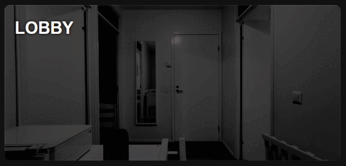
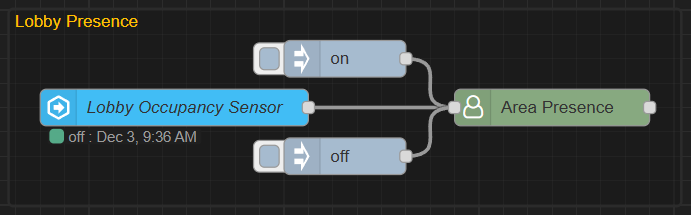
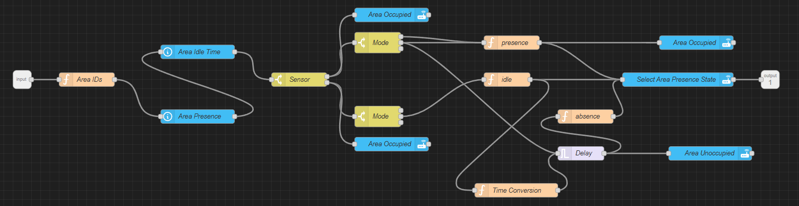
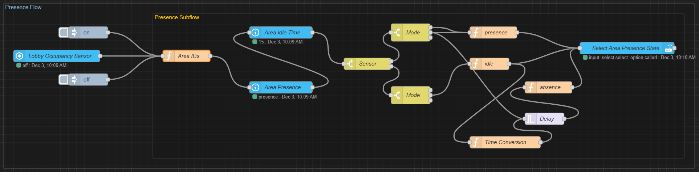
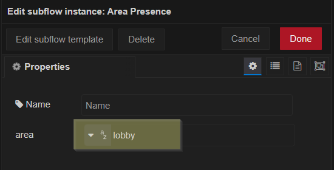

# Room & Area Occupancy Model

## Overview

In each area and room where three are sensors, this flow updates 2 helper entities input_boolean.area_occupancy is set on or off, and input_select.area_presence to one of these options presence | idle | absence. 

Idle here presents a defined time between presence and absence mode, when the room was recently occupied, but sensor is not detecting occupancy anymore. After the idle time has passed the input_select.area_presence changes to absent.

The input_select.area_presence is then to visualize the current area or room occupancy state in my declutter "room card".

The input_select.area_presence is also used in my light automations which can be set the presence mode, absence detection, manual mode or follow-the-sun mode.

For clarity the Node-Red flow has been divided to a subflow, which has one envinronment variable [area] that needs to be defined.

## Area Presence Flow & Declutter Room Card

[Check the room card here](https://github.com/EvisHome/Home-Assistant/blob/main/cards/room-card.md)

<p float="left">   </p> 

## Background

This sort of started me wanting some visualized debugging method back when I had some presence anomalies I had around the house and seeing how when presence was detected and how my light automations worked .. and like usually things escalated from there. This is no part of my normal home view in my room cards giving an visualized overview of room occupancy states.

## Node-RED JSON

```json
[{"id":"39f7b292a0a339d9","type":"subflow","name":"Area Presence","info":"","category":"","in":[{"x":120,"y":240,"wires":[{"id":"9f3936e2a6de7e69"}]}],"out":[{"x":1740,"y":240,"wires":[{"id":"578b98b4bea9907a","port":0}]}],"env":[{"name":"area","type":"str","value":"area_name"}],"meta":{},"color":"#87A980","icon":"font-awesome/fa-user-o"},{"id":"2a11a0e47c3d1e8d","type":"switch","z":"39f7b292a0a339d9","name":"Sensor","property":"payload","propertyType":"msg","rules":[{"t":"eq","v":"on","vt":"str"},{"t":"eq","v":"off","vt":"str"}],"checkall":"true","repair":false,"outputs":2,"x":720,"y":240,"wires":[["f710868e4257871e","330ef7c4b7514207"],["584885b59a166a1a","6a8ad33929d3c7c5"]]},{"id":"3f95edf9e6c70810","type":"trigger","z":"39f7b292a0a339d9","name":"Delay","op1":"","op2":"0","op1type":"nul","op2type":"str","duration":"1","extend":true,"overrideDelay":true,"units":"s","reset":"on","bytopic":"all","topic":"topic","outputs":1,"x":1330,"y":400,"wires":[["c012e4f9c43aafdb","2969aca48c51a566"]]},{"id":"954d8018549f3a91","type":"function","z":"39f7b292a0a339d9","name":"Time Conversion","func":"var seconds = msg.timeout_delay;\nvar delay = seconds * 1000;\n// HH:MM:SS\n// var timer = new Date(seconds * 1000).toISOString().substring(11, 16)\n// MM:SS\nvar timer = new Date(delay).toISOString().slice(11, 19)\n\nmsg.delay = delay;\nmsg.timer = timer\nreturn msg;","outputs":1,"noerr":0,"initialize":"","finalize":"","libs":[],"x":1190,"y":480,"wires":[["3f95edf9e6c70810"]]},{"id":"c012e4f9c43aafdb","type":"function","z":"39f7b292a0a339d9","name":"absence","func":"msg.payload = \n{\n  \"data\": {\n    \"option\": \"absence\",\n  }\n}\nreturn msg;","outputs":1,"timeout":0,"noerr":0,"initialize":"","finalize":"","libs":[],"x":1340,"y":320,"wires":[["578b98b4bea9907a"]]},{"id":"54b12a2404c409d9","type":"function","z":"39f7b292a0a339d9","name":"idle","func":"msg.payload = \n{\n  \"data\": {\n    \"option\": \"idle\",\n  }\n}\nreturn msg;","outputs":1,"timeout":0,"noerr":0,"initialize":"","finalize":"","libs":[],"x":1170,"y":240,"wires":[["578b98b4bea9907a","954d8018549f3a91"]]},{"id":"1f1d2cf4c3e745b9","type":"function","z":"39f7b292a0a339d9","name":"presence","func":"msg.payload = \n{\n  \"data\": {\n    \"option\": \"presence\",\n  }\n}\nreturn msg;","outputs":1,"timeout":0,"noerr":0,"initialize":"","finalize":"","libs":[],"x":1180,"y":160,"wires":[["578b98b4bea9907a","82582069831f2ff9"]]},{"id":"578b98b4bea9907a","type":"api-call-service","z":"39f7b292a0a339d9","name":"Select Area Presence State","server":"ad8e916b512776fd","version":7,"debugenabled":false,"action":"input_select.select_option","floorId":[],"areaId":[],"deviceId":[],"entityId":["{{area_id}}"],"labelId":[],"data":"","dataType":"jsonata","mergeContext":"","mustacheAltTags":false,"outputProperties":[],"queue":"none","blockInputOverrides":false,"domain":"input_select","service":"select_option","x":1540,"y":240,"wires":[[]]},{"id":"f710868e4257871e","type":"switch","z":"39f7b292a0a339d9","name":"Mode","property":"presence","propertyType":"msg","rules":[{"t":"eq","v":"absence","vt":"str"},{"t":"eq","v":"idle","vt":"str"},{"t":"eq","v":"presence","vt":"str"}],"checkall":"true","repair":false,"outputs":3,"x":890,"y":160,"wires":[["1f1d2cf4c3e745b9"],["1f1d2cf4c3e745b9","3f95edf9e6c70810"],[]]},{"id":"584885b59a166a1a","type":"switch","z":"39f7b292a0a339d9","name":"Mode","property":"presence","propertyType":"msg","rules":[{"t":"eq","v":"absence","vt":"str"},{"t":"eq","v":"presence","vt":"str"},{"t":"eq","v":"idle","vt":"str"}],"checkall":"true","repair":false,"outputs":3,"x":890,"y":320,"wires":[[],["54b12a2404c409d9"],[]]},{"id":"d6e7662f653496fc","type":"api-current-state","z":"39f7b292a0a339d9","name":"Area Presence","server":"ad8e916b512776fd","version":3,"outputs":1,"halt_if":"","halt_if_type":"str","halt_if_compare":"is","entity_id":"{{area_presence_id}}","state_type":"str","blockInputOverrides":false,"outputProperties":[{"property":"area_id","propertyType":"msg","value":"","valueType":"triggerId"},{"property":"presence","propertyType":"msg","value":"","valueType":"entityState"}],"for":0,"forType":"num","forUnits":"minutes","x":500,"y":320,"wires":[["e201bc0be2db027b"]]},{"id":"e201bc0be2db027b","type":"api-current-state","z":"39f7b292a0a339d9","name":"Area Idle Time","server":"ad8e916b512776fd","version":3,"outputs":1,"halt_if":"","halt_if_type":"str","halt_if_compare":"is","entity_id":"{{area_idle_time_id}}","state_type":"num","blockInputOverrides":false,"outputProperties":[{"property":"timeout_delay","propertyType":"msg","value":"","valueType":"entityState"}],"for":0,"forType":"num","forUnits":"seconds","x":500,"y":180,"wires":[["2a11a0e47c3d1e8d"]]},{"id":"9f3936e2a6de7e69","type":"function","z":"39f7b292a0a339d9","name":"Area IDs","func":"var area\n\n\nif (area == null) {\n    area = env.get(\"area\")\n}\n\nvar area_presence_id = \"input_select.\" + area + \"_presence\"\nvar area_occupancy_id = \"input_boolean.\" + area + \"_occupancy\"\nvar area_idle_time_id = \"input_number.\" + area + \"_presence_idle_time\"\n\n\n//msg.payload = change\nmsg.area_presence_id = area_presence_id\nmsg.area_idle_time_id = area_idle_time_id\nmsg.area_occupancy_id = area_occupancy_id\nreturn msg;","outputs":1,"timeout":"","noerr":0,"initialize":"","finalize":"","libs":[],"x":260,"y":240,"wires":[["d6e7662f653496fc"]]},{"id":"330ef7c4b7514207","type":"api-call-service","z":"39f7b292a0a339d9","name":"Area Occupied","server":"ad8e916b512776fd","version":7,"debugenabled":false,"action":"input_boolean.turn_on","floorId":[],"areaId":[],"deviceId":[],"entityId":["{{area_occupancy_id}}"],"labelId":[],"data":"","dataType":"jsonata","mergeContext":"","mustacheAltTags":false,"outputProperties":[],"queue":"none","blockInputOverrides":false,"domain":"input_boolean","service":"turn_on","x":920,"y":100,"wires":[[]]},{"id":"6a8ad33929d3c7c5","type":"api-call-service","z":"39f7b292a0a339d9","name":"Area Occupied","server":"ad8e916b512776fd","version":7,"debugenabled":false,"action":"input_boolean.turn_off","floorId":[],"areaId":[],"deviceId":[],"entityId":["{{area_occupancy_id}}"],"labelId":[],"data":"","dataType":"jsonata","mergeContext":"","mustacheAltTags":false,"outputProperties":[],"queue":"none","blockInputOverrides":false,"domain":"input_boolean","service":"turn_off","x":920,"y":380,"wires":[[]]},{"id":"82582069831f2ff9","type":"api-call-service","z":"39f7b292a0a339d9","name":"Area Occupied","server":"ad8e916b512776fd","version":7,"debugenabled":false,"action":"input_boolean.turn_on","floorId":[],"areaId":[],"deviceId":[],"entityId":["{{area_occupancy_id}}"],"labelId":[],"data":"","dataType":"jsonata","mergeContext":"","mustacheAltTags":false,"outputProperties":[],"queue":"none","blockInputOverrides":true,"domain":"input_boolean","service":"turn_on","x":1580,"y":160,"wires":[[]]},{"id":"2969aca48c51a566","type":"api-call-service","z":"39f7b292a0a339d9","name":"Area Unoccupied","server":"ad8e916b512776fd","version":7,"debugenabled":false,"action":"input_boolean.turn_off","floorId":[],"areaId":[],"deviceId":[],"entityId":["{{area_occupancy_id}}"],"labelId":[],"data":"","dataType":"jsonata","mergeContext":"","mustacheAltTags":false,"outputProperties":[],"queue":"none","blockInputOverrides":true,"domain":"input_boolean","service":"turn_off","x":1610,"y":400,"wires":[[]]},{"id":"ad8e916b512776fd","type":"server","name":"Home Assistant","version":5,"addon":true,"rejectUnauthorizedCerts":true,"ha_boolean":"y|yes|true|on|home|open","connectionDelay":true,"cacheJson":true,"heartbeat":false,"heartbeatInterval":"30","areaSelector":"friendlyName","deviceSelector":"friendlyName","entitySelector":"friendlyName","statusSeparator":": ","statusYear":"hidden","statusMonth":"short","statusDay":"numeric","statusHourCycle":"default","statusTimeFormat":"h:m","enableGlobalContextStore":false},{"id":"284988455cf2e547","type":"subflow:39f7b292a0a339d9","z":"8da9800f6edcd8f8","g":"608653a22b70b06e","name":"","env":[{"name":"area","value":"lobby","type":"str"}],"x":540,"y":240,"wires":[[]]}]
```



Here is the full JSON example with the Area Presence subflow, in case you want to check the lobby example.

```json
[{"id":"39f7b292a0a339d9","type":"subflow","name":"Area Presence","info":"","category":"","in":[{"x":120,"y":240,"wires":[{"id":"9f3936e2a6de7e69"}]}],"out":[{"x":1740,"y":240,"wires":[{"id":"578b98b4bea9907a","port":0}]}],"env":[{"name":"area","type":"str","value":"area_name"}],"meta":{},"color":"#87A980","icon":"font-awesome/fa-user-o"},{"id":"2a11a0e47c3d1e8d","type":"switch","z":"39f7b292a0a339d9","name":"Sensor","property":"payload","propertyType":"msg","rules":[{"t":"eq","v":"on","vt":"str"},{"t":"eq","v":"off","vt":"str"}],"checkall":"true","repair":false,"outputs":2,"x":720,"y":240,"wires":[["f710868e4257871e","330ef7c4b7514207"],["584885b59a166a1a","6a8ad33929d3c7c5"]]},{"id":"3f95edf9e6c70810","type":"trigger","z":"39f7b292a0a339d9","name":"Delay","op1":"","op2":"0","op1type":"nul","op2type":"str","duration":"1","extend":true,"overrideDelay":true,"units":"s","reset":"on","bytopic":"all","topic":"topic","outputs":1,"x":1330,"y":400,"wires":[["c012e4f9c43aafdb","2969aca48c51a566"]]},{"id":"954d8018549f3a91","type":"function","z":"39f7b292a0a339d9","name":"Time Conversion","func":"var seconds = msg.timeout_delay;\nvar delay = seconds * 1000;\n// HH:MM:SS\n// var timer = new Date(seconds * 1000).toISOString().substring(11, 16)\n// MM:SS\nvar timer = new Date(delay).toISOString().slice(11, 19)\n\nmsg.delay = delay;\nmsg.timer = timer\nreturn msg;","outputs":1,"noerr":0,"initialize":"","finalize":"","libs":[],"x":1190,"y":480,"wires":[["3f95edf9e6c70810"]]},{"id":"c012e4f9c43aafdb","type":"function","z":"39f7b292a0a339d9","name":"absence","func":"msg.payload = \n{\n  \"data\": {\n    \"option\": \"absence\",\n  }\n}\nreturn msg;","outputs":1,"timeout":0,"noerr":0,"initialize":"","finalize":"","libs":[],"x":1340,"y":320,"wires":[["578b98b4bea9907a"]]},{"id":"54b12a2404c409d9","type":"function","z":"39f7b292a0a339d9","name":"idle","func":"msg.payload = \n{\n  \"data\": {\n    \"option\": \"idle\",\n  }\n}\nreturn msg;","outputs":1,"timeout":0,"noerr":0,"initialize":"","finalize":"","libs":[],"x":1170,"y":240,"wires":[["578b98b4bea9907a","954d8018549f3a91"]]},{"id":"1f1d2cf4c3e745b9","type":"function","z":"39f7b292a0a339d9","name":"presence","func":"msg.payload = \n{\n  \"data\": {\n    \"option\": \"presence\",\n  }\n}\nreturn msg;","outputs":1,"timeout":0,"noerr":0,"initialize":"","finalize":"","libs":[],"x":1180,"y":160,"wires":[["578b98b4bea9907a","82582069831f2ff9"]]},{"id":"578b98b4bea9907a","type":"api-call-service","z":"39f7b292a0a339d9","name":"Select Area Presence State","server":"ad8e916b512776fd","version":7,"debugenabled":false,"action":"input_select.select_option","floorId":[],"areaId":[],"deviceId":[],"entityId":["{{area_id}}"],"labelId":[],"data":"","dataType":"jsonata","mergeContext":"","mustacheAltTags":false,"outputProperties":[],"queue":"none","blockInputOverrides":false,"domain":"input_select","service":"select_option","x":1540,"y":240,"wires":[[]]},{"id":"f710868e4257871e","type":"switch","z":"39f7b292a0a339d9","name":"Mode","property":"presence","propertyType":"msg","rules":[{"t":"eq","v":"absence","vt":"str"},{"t":"eq","v":"idle","vt":"str"},{"t":"eq","v":"presence","vt":"str"}],"checkall":"true","repair":false,"outputs":3,"x":890,"y":160,"wires":[["1f1d2cf4c3e745b9"],["1f1d2cf4c3e745b9","3f95edf9e6c70810"],[]]},{"id":"584885b59a166a1a","type":"switch","z":"39f7b292a0a339d9","name":"Mode","property":"presence","propertyType":"msg","rules":[{"t":"eq","v":"absence","vt":"str"},{"t":"eq","v":"presence","vt":"str"},{"t":"eq","v":"idle","vt":"str"}],"checkall":"true","repair":false,"outputs":3,"x":890,"y":320,"wires":[[],["54b12a2404c409d9"],[]]},{"id":"d6e7662f653496fc","type":"api-current-state","z":"39f7b292a0a339d9","name":"Area Presence","server":"ad8e916b512776fd","version":3,"outputs":1,"halt_if":"","halt_if_type":"str","halt_if_compare":"is","entity_id":"{{area_presence_id}}","state_type":"str","blockInputOverrides":false,"outputProperties":[{"property":"area_id","propertyType":"msg","value":"","valueType":"triggerId"},{"property":"presence","propertyType":"msg","value":"","valueType":"entityState"}],"for":0,"forType":"num","forUnits":"minutes","x":500,"y":320,"wires":[["e201bc0be2db027b"]]},{"id":"e201bc0be2db027b","type":"api-current-state","z":"39f7b292a0a339d9","name":"Area Idle Time","server":"ad8e916b512776fd","version":3,"outputs":1,"halt_if":"","halt_if_type":"str","halt_if_compare":"is","entity_id":"{{area_idle_time_id}}","state_type":"num","blockInputOverrides":false,"outputProperties":[{"property":"timeout_delay","propertyType":"msg","value":"","valueType":"entityState"}],"for":0,"forType":"num","forUnits":"seconds","x":500,"y":180,"wires":[["2a11a0e47c3d1e8d"]]},{"id":"9f3936e2a6de7e69","type":"function","z":"39f7b292a0a339d9","name":"Area IDs","func":"var area\n\n\nif (area == null) {\n    area = env.get(\"area\")\n}\n\nvar area_presence_id = \"input_select.\" + area + \"_presence\"\nvar area_occupancy_id = \"input_boolean.\" + area + \"_occupancy\"\nvar area_idle_time_id = \"input_number.\" + area + \"_presence_idle_time\"\n\n\n//msg.payload = change\nmsg.area_presence_id = area_presence_id\nmsg.area_idle_time_id = area_idle_time_id\nmsg.area_occupancy_id = area_occupancy_id\nreturn msg;","outputs":1,"timeout":"","noerr":0,"initialize":"","finalize":"","libs":[],"x":260,"y":240,"wires":[["d6e7662f653496fc"]]},{"id":"330ef7c4b7514207","type":"api-call-service","z":"39f7b292a0a339d9","name":"Area Occupied","server":"ad8e916b512776fd","version":7,"debugenabled":false,"action":"input_boolean.turn_on","floorId":[],"areaId":[],"deviceId":[],"entityId":["{{area_occupancy_id}}"],"labelId":[],"data":"","dataType":"jsonata","mergeContext":"","mustacheAltTags":false,"outputProperties":[],"queue":"none","blockInputOverrides":false,"domain":"input_boolean","service":"turn_on","x":920,"y":100,"wires":[[]]},{"id":"6a8ad33929d3c7c5","type":"api-call-service","z":"39f7b292a0a339d9","name":"Area Occupied","server":"ad8e916b512776fd","version":7,"debugenabled":false,"action":"input_boolean.turn_off","floorId":[],"areaId":[],"deviceId":[],"entityId":["{{area_occupancy_id}}"],"labelId":[],"data":"","dataType":"jsonata","mergeContext":"","mustacheAltTags":false,"outputProperties":[],"queue":"none","blockInputOverrides":false,"domain":"input_boolean","service":"turn_off","x":920,"y":380,"wires":[[]]},{"id":"82582069831f2ff9","type":"api-call-service","z":"39f7b292a0a339d9","name":"Area Occupied","server":"ad8e916b512776fd","version":7,"debugenabled":false,"action":"input_boolean.turn_on","floorId":[],"areaId":[],"deviceId":[],"entityId":["{{area_occupancy_id}}"],"labelId":[],"data":"","dataType":"jsonata","mergeContext":"","mustacheAltTags":false,"outputProperties":[],"queue":"none","blockInputOverrides":true,"domain":"input_boolean","service":"turn_on","x":1580,"y":160,"wires":[[]]},{"id":"2969aca48c51a566","type":"api-call-service","z":"39f7b292a0a339d9","name":"Area Unoccupied","server":"ad8e916b512776fd","version":7,"debugenabled":false,"action":"input_boolean.turn_off","floorId":[],"areaId":[],"deviceId":[],"entityId":["{{area_occupancy_id}}"],"labelId":[],"data":"","dataType":"jsonata","mergeContext":"","mustacheAltTags":false,"outputProperties":[],"queue":"none","blockInputOverrides":true,"domain":"input_boolean","service":"turn_off","x":1610,"y":400,"wires":[[]]},{"id":"2c9df5744e462b67","type":"server-state-changed","z":"8da9800f6edcd8f8","g":"608653a22b70b06e","name":"Lobby Occupancy Sensor","server":"ad8e916b512776fd","version":6,"outputs":1,"exposeAsEntityConfig":"","entities":{"entity":["binary_sensor.upstairs_lobby_fp2_presence_sensor"],"substring":[],"regex":[]},"outputInitially":true,"stateType":"str","ifState":"","ifStateType":"str","ifStateOperator":"is","outputOnlyOnStateChange":false,"for":"0","forType":"num","forUnits":"minutes","ignorePrevStateNull":false,"ignorePrevStateUnknown":false,"ignorePrevStateUnavailable":false,"ignoreCurrentStateUnknown":false,"ignoreCurrentStateUnavailable":false,"outputProperties":[{"property":"payload","propertyType":"msg","value":"","valueType":"entityState"}],"x":230,"y":240,"wires":[["284988455cf2e547"]]},{"id":"284988455cf2e547","type":"subflow:39f7b292a0a339d9","z":"8da9800f6edcd8f8","g":"608653a22b70b06e","name":"","env":[{"name":"area","value":"lobby","type":"str"}],"x":540,"y":240,"wires":[[]]},{"id":"92e57e46c92c5004","type":"inject","z":"8da9800f6edcd8f8","g":"608653a22b70b06e","name":"","props":[{"p":"payload"}],"repeat":"","crontab":"","once":false,"onceDelay":0.1,"topic":"","payload":"on","payloadType":"str","x":370,"y":200,"wires":[["284988455cf2e547"]]},{"id":"8e1a9e17d125657d","type":"inject","z":"8da9800f6edcd8f8","g":"608653a22b70b06e","name":"","props":[{"p":"payload"}],"repeat":"","crontab":"","once":false,"onceDelay":0.1,"topic":"","payload":"off","payloadType":"str","x":370,"y":280,"wires":[["284988455cf2e547"]]},{"id":"ad8e916b512776fd","type":"server","name":"Home Assistant","version":5,"addon":true,"rejectUnauthorizedCerts":true,"ha_boolean":"y|yes|true|on|home|open","connectionDelay":true,"cacheJson":true,"heartbeat":false,"heartbeatInterval":"30","areaSelector":"friendlyName","deviceSelector":"friendlyName","entitySelector":"friendlyName","statusSeparator":": ","statusYear":"hidden","statusMonth":"short","statusDay":"numeric","statusHourCycle":"default","statusTimeFormat":"h:m","enableGlobalContextStore":false}]
```



## Setup

Couple of helper entities are needed to get this functioning

### Helper Entities

* __input_boolean.lobby_occupancy__

this replicates the trigger sensor state (used in some automations, and wanted to follow certain naming model)

* __input_select.lobby_presence__

presence | idle | absence

* __input_number.lobby_presence_idle_time__

idle time in seconds after no presence detected

### Node-Red Flow setup

You need something that detects presence and delivers on | off state to the the presence subflow. In most rooms I use Aqara FP2s, I have few DIY mmWave radars in some rooms, Frigate Person detection in outdoor areas, and PIR based sensors.


For the area presence subflow, edit the area variable to match your helper entity area name



## Room Cards Presence Visualization Example

This example how I am using this presence model in tandem with the declutter room card and my light automation visualization. A speed up version of me coming home from the front-door, to mud room, through hallway to kitchen .. checking the fridge, turning on coffee machine ..
