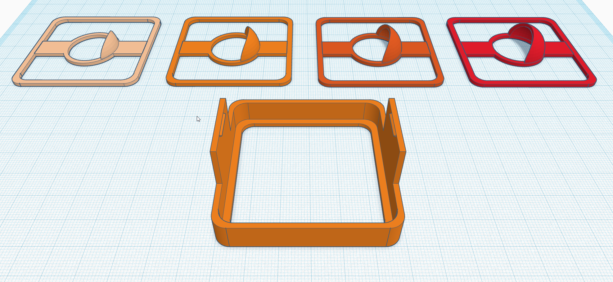
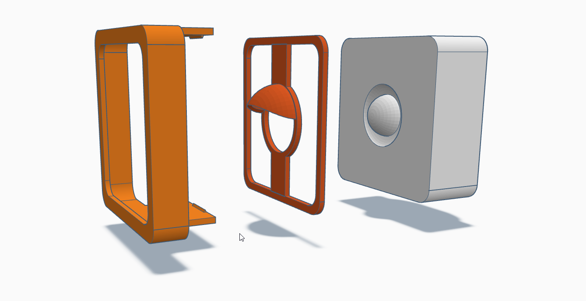

# Philips Hue Motion Sensor Eye Lid

3D Printable "eye lids" for Philips Hue Motion Sensor. If you need to partially block part of the monitored area, and cannot adjust the sensor.

## Parts
* [Philips Hue Motion Sensor - Eye Lid](https://www.tinkercad.com/things/fWPtAOjGvGs-hue-motion-sensor-eye-lid)

## Instructions

