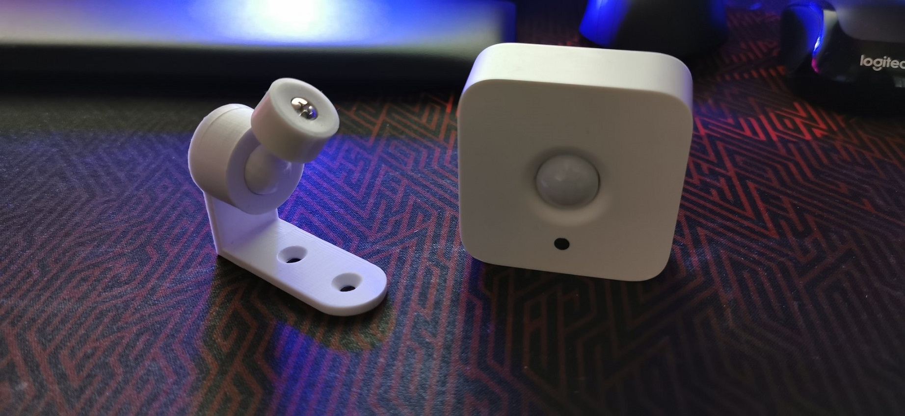
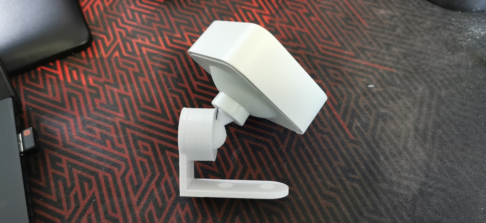
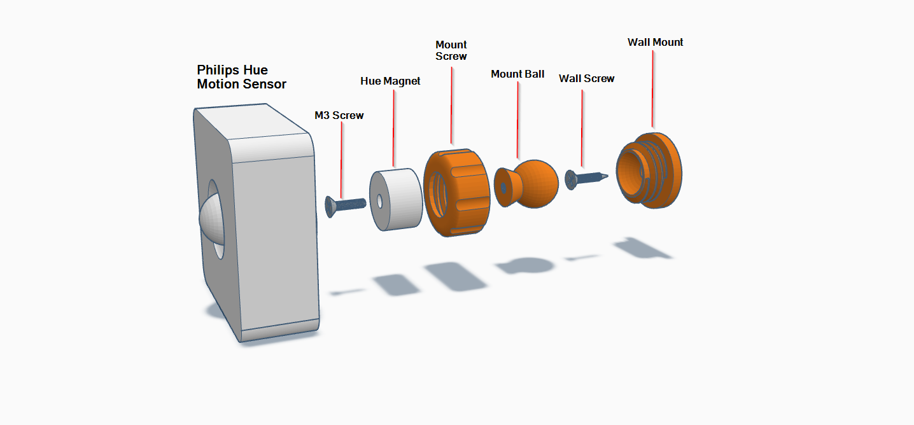
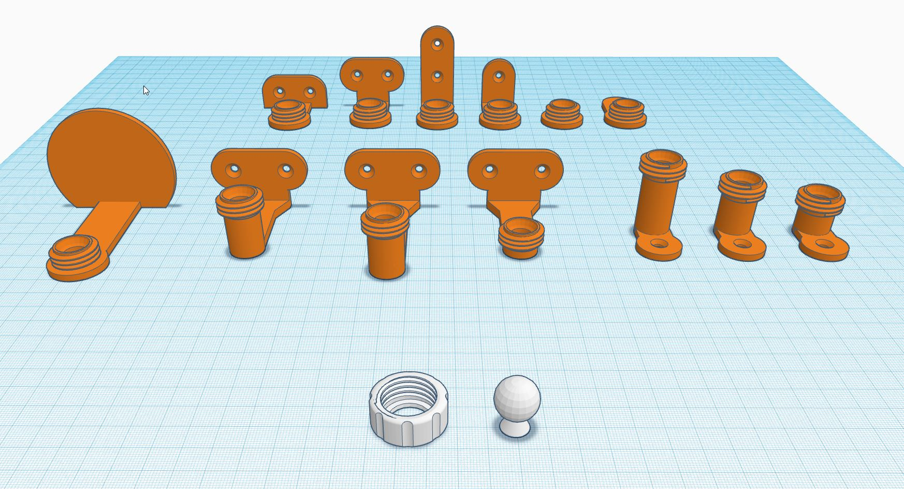

# Philips Hue Motion Sensor Wall Mount

  
 

3D printable wall mount for [Philips Hue Motion sensor](https://amzn.to/3eFKGZe), give a little bit wider rotation angles, and allows easy battery changes while keeping the mount aligned to the correct direction. The mount is compatible with my ESPHome projects [Room Presence](https://github.com/EvisHome/Home-Assistant/tree/main/esphome/presence) and [Presence Box 2](https://github.com/EvisHome/Home-Assistant/tree/main/esphome/presence-box-2) and can be mixed with all the different mount options.

## Parts

* [Philips Hue Motion Sensor](https://amzn.to/3eFKGZe)
* [3D Printable Mounting Parts](https://www.tinkercad.com/things/9wCn1o8V80X-sensor-mounting-set)
* M3 10mm or M3 12mm screw to attach the Hue Magnet to the adjustment ball
* Screw(s) for attaching the mount to a wall/ceiling (4mm hole)

## Installation

## Mount Options

