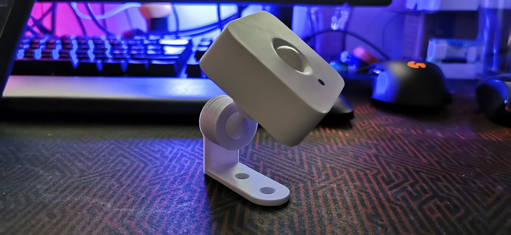
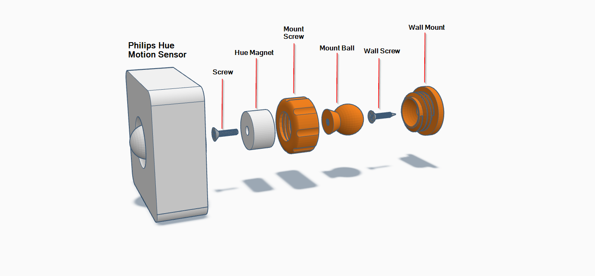

# Philips Hue Motion Sensor Wall Mount

  
 

3D printable wall mount for [Philips Hue Motion sensor](https://amzn.to/3eFKGZe), give a little bit wider rotation angles, and allows easy battery changes while keeping the mount aligned to the correct direction. The mount is compatible with my ESPHome projects [Room Presence](https://github.com/EvisHome/Home-Assistant/tree/main/esphome/presence) and [Presence Box 2](https://github.com/EvisHome/Home-Assistant/tree/main/esphome/presence-box-2) and can be mixed with all the different mount options.

## Parts

* [Philips Hue Motion Sensor](https://amzn.to/3eFKGZe)
* 3D Printable Mounting Parts | [Printables.com](https://www.printables.com/model/273578-philips-hue-motion-sensor-wall-mount) | [TinkerCad (Source Model)](https://www.tinkercad.com/things/9wCn1o8V80X-sensor-mounting-set)
* Screws: preferabl use a countersunk screws. There are two versions of the mount ball, one that should work with M3 screws (10mm or 12mm) and other one that should work with #6 - 32 UNC screw (9.5mm?)
* "Wall Screw(s)" for attaching the mount to a wall/ceiling (4mm hole)

## Installation

## Mount Options

